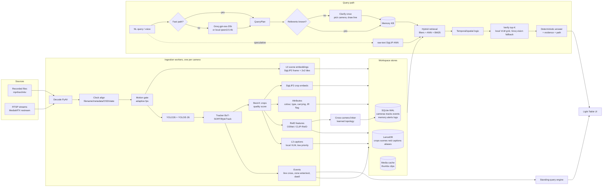

# evora — Master Plan for HNX26EPS05
### Multi-Stream Video Intelligence with Conversational Query

> Working name: **evora** (Tamil/Malayalam: *watch, guard*). Rename freely; the Python package is `evora`.
> This file is **local-only** (never committed). `PROGRESS.md` is the shared, committed source of truth for live state.
> Plan written and verified on 8 Oct 2026. Every external fact in §2 was checked that day; re-run the H0 checks anyway.

---

## Contents

- §0 Read me first
- §1 Winning thesis and rubric map
- §2 Verified facts (8 Oct 2026) and what they force
- §3 System architecture
- §4 Research contributions and ablations
- §5 Contracts v1 (frozen) — layout, ownership, schema, models, API, interfaces
- §6 Models, tools, datasets — registry with exact access steps
- §7 Timeline and checkpoints (15 hours)
- §8 Workstreams — M1, M2, M3, M4
- §9 Validation and evaluation
- §10 UI design system — "The Light Table"
- §11 Demo, write-up, submission
- §12 Session protocol (coding sessions, handoffs, commits)
- §13 Risk register
- Appendix A — Planner prompt skeleton
- Appendix B — Own-footage recording script
- Appendix C — Judge-day runbook

---

## §0 Read me first

**Who reads what**

| Reader | Must read | Then |
|---|---|---|
| Every human, once | §0, §1, §2, §7, your §8.x, §12 | skim the rest |
| Every coding session at start | `CLAUDE.md` (auto), §0–§5, your §8.x, §9, §12, all of `PROGRESS.md` | your phase tasks |
| M4 (UI) additionally | §10 in full | |
| M3 (science) additionally | §4, §9 in full | |

**Files in the kit**

| File | Tracked in git? | Purpose |
|---|---|---|
| `PLAN.md` | No (local) | This plan. Static. Changes go into `PROGRESS.md` → Decisions. |
| `CLAUDE.md` | No (local) | Session rules auto-loaded by every coding session. |
| `.claude/settings.local.json` | No (local) | Model choice, attribution off, permission allow-list. |
| `.git/hooks/commit-msg`, `pre-commit` | No (local) | Strip/block tool mentions; block local-only files from being staged. |
| `PROGRESS.md` | **Yes** | Single live progress file for the whole team. Union-merge enabled. |
| `.gitattributes` | **Yes** | `PROGRESS.md merge=union` so simultaneous log appends never conflict. |
| `setup-local.sh` | No | Each member runs once after cloning: installs all of the above. |

**The six rules**

1. **Contracts first.** Everyone codes against §5 from minute one. Only M1 edits `contracts/`, and only via the change protocol (§5.8).
2. **Own your directory.** Read anything; write only inside your area (§5.1), plus your own block and log lines in `PROGRESS.md`.
3. **Main is always runnable.** `make check` before every push. `git pull --rebase` at least every 45 minutes.
4. **Thin, then thick.** An end-to-end slice at H4 beats four perfect modules that have never met.
5. **Every claim is measured.** Numbers in the write-up and the pitch come from `make eval`, never from memory.
6. **Offline-capable.** The demo must run with Wi-Fi off (on-prem mode). Venue internet is not a dependency.

---

## §1 Winning thesis and rubric map

**Thesis.** Most teams will sample frames, embed them with CLIP, and wrap an LLM around it. That is exactly the baseline. We index **things that move** (tracks), describe them with **grounded attributes**, remember **places** learned through **one clarification**, link identities **across cameras with a learned topology**, and prove every answer with a **clip, a circled object, and dual timestamps**. Then we show the ablation that proves which part mattered.

| Rubric item | Weight | Our lever (owner) | Proof we show judges |
|---|---|---|---|
| Retrieval accuracy on held-out NL queries vs baseline | 30% | Track-centric multi-granular index (C1), attribute grounding (C2), plan-then-verify (C3) — M2, M3 | Main results table vs the *strongest* of two baselines, same footage, same hardware |
| Camera + timestamp localization | 20% | Track spans and event-level timestamps (line crossing frame), dual timestamps (wall clock + file offset), clip evidence — M2, M1 | Median timestamp error, temporal IoU, camera accuracy |
| Clarify-once memory | 20% | Persistent referent KB with alias embeddings, ambiguity handling, per-site workspaces, retroactive zones (C4) — M1 | Live restart during demo; paraphrase test; visible "Known places" ledger; re-ask count = 0 in eval |
| Query latency vs baseline | 10% | Fast-path parser, plan cache, speculative retrieval, smaller track index, async verification — M3 | p50/p95 time-to-first-answer and time-to-verified-answer, both reported honestly |
| Research contribution | 20% | Six named contributions with one ablation row each (§4) — M3 | Ablation table, report page, write-up |
| Bonus | — | All four: live ingestion, cross-camera re-ID + path, standing queries + alerts, privacy (on-prem mode, face blur, audit, evidence pack) | Each one in the demo script (§11) |

**What makes it "10x" rather than "meets the bar"**

1. Progressive indexing: queries work minutes after upload (layers L0→L3), essential when judges hand over unseen footage.
2. Retroactive zones: define "main gate" as a line *after* ingestion; crossing events are recomputed from stored tracks in seconds, no re-ingest.
3. Query by example: click any evidence and ask "where else did this person go?"
4. Grounded negatives: "No red car crossed the main gate between 09:00 and 10:00. Closest: maroon SUV at 09:41, score 0.31."
5. Deterministic, citation-checked answer text (no hallucinated prose); the language model plans, it does not invent evidence.
6. Auto clock sync from the camera's on-screen timestamp, or a phone "slate" filmed at the start of recording.
7. Chain-of-custody evidence pack: clip, frames, provenance JSON, SHA-256 manifest.
8. `make doctor`: one command that tells you the machine is demo-ready.

**Judging-day reality** (design for it, not for our own footage):
judges bring unseen multi-camera recordings and queries with known answers. That means ingestion speed, clock alignment, robustness to odd codecs and night footage, and honest negatives matter as much as clever retrieval. We rehearse this exact situation at H12 (§9.6).

---

## §2 Verified facts (8 Oct 2026) and what they force

| Fact (checked 8 Oct 2026) | Consequence for us |
|---|---|
| Groq **free plan** text models are now `openai/gpt-oss-120b`, `openai/gpt-oss-20b`, preview `qwen/qwen3.8-27b` (multimodal), plus `whisper-large-v3` and `whisper-large-v3-turbo`. `llama-3.1-8b-instant` and `llama-3.3-70b-versatile` are listed as **Enterprise / contact sales**. | Do not build on Llama models via Groq. Planner = `gpt-oss-20b`; hard plans / describe = `gpt-oss-120b`; vision fallback = `qwen3.8-27b`; voice = `whisper-large-v3-turbo`. |
| Free-plan sample limits per model: **30 RPM, 1K RPD, 8K TPM, 200K TPD** for gpt-oss-120b, gpt-oss-20b and qwen3.8-27b; Whisper 20 RPM, 2K RPD, 7.2K audio-seconds/hour. Exact limits live at console.groq.com/settings/limits. | 8K tokens/minute is tight. Keep prompts compact, cache plans, use the fast path, make the answer text deterministic. |
| Limits apply **per organization**, not per key or user. | Each member creates a key in **their own personal Groq account**. Four keys inside one org add nothing. |
| `qwen/qwen3.8-27b` vision: max **3 images per request**, each image counts as **2,048 input tokens**; it is a *preview* model that may be withdrawn at short notice. | ~3 images per minute per key. Use only for top-3 verification, batch candidates into a contact-sheet grid (one image, many crops), and never depend on it: local VLM is primary. |
| Groq prompt caching works on gpt-oss models; **cached tokens do not count toward rate limits**; cache needs exact prefix match; caches expire after ~2 hours unused. | Static system prompt + schema + few-shots first, user query last. Keep them byte-identical across calls. |
| MEVA (Kitware) is on the AWS Open Data registry: bucket `mevadata-public-01`, **no AWS account required** (`aws s3 ls --no-sign-request s3://mevadata-public-01/`). 29 cameras, overlapping and non-overlapping, ~328 h video, annotations for ~184 h, plus camera models and a site map. Annotations live in `gitlab.kitware.com/meva/meva-data-repo`. One GitLab issue reports download trouble; a DagsHub mirror exists. | MEVA is our primary realistic dataset (people + vehicles + activities). Download a small slice only. Have the fallback chain ready (§6.3). |
| WILDTRACK (EPFL): 7 synchronized static 1080p cameras, overlapping views. Direct zip of 10 fps frames + annotations (`Wildtrack_dataset_full.zip`), full videos on Google Drive (one link per camera). | Good for overlapping-view re-ID and pedestrian density. Convert frames to mp4 if Drive quota blocks. |
| EPFL "Multi-camera pedestrians" sequences (laboratory, campus, terrace, passageway, basketball): direct `.avi` links, synchronized, research use, several encoded with Indeo 5. | Fastest data to start with (minutes). Transcode to H.264 mp4 on download. |
| CityFlow / AI City Challenge (vehicle multi-camera) is not an open bucket download in our checks. | Skip. Do not block on it. |
| Ultralytics ships **YOLO26** and **YOLOE-26** (open-vocabulary: text prompts, visual prompts, prompt-free mode with a large built-in vocabulary via `-pf` checkpoints). License AGPL-3.0. | Closed-set detector + open-vocab detector from one library. State AGPL in the write-up. |
| `google/siglip2-base-patch16-224` on Hugging Face, Apache-2.0. | Main image-text embedding model. |
| Qwen3-VL 2B/4B Instruct: Apache-2.0; Ollama tags `qwen3-vl:2b`, `qwen3-vl:4b`; Ollama also lists `qwen3.5` small sizes (0.8b/2b/4b/9b) with vision + tools. | Local VLM verifier and on-prem language model, all ≤ 7B. |
| BoxMOT (AGPL-3.0): many trackers, auto-downloadable ReID weights (OSNet, LightMBN, CLIP-ReID people and vehicle models). | Person/vehicle re-ID features without training. |
| Claude Code settings schema has `attribution.commit`, `attribution.pr` (empty string hides) and `attribution.sessionUrl` (false omits the session trailer). `includeCoAuthoredBy` is deprecated. There are public bug reports of trailers still appearing when commits are crafted via shell. | Settings **plus** a local `commit-msg` hook that strips and blocks. The hook is the guarantee. |
| Kaggle notebooks: ~30 GPU-hours/week commonly reported (exact quota shown in your account, not in docs), 12-hour GPU sessions. | Optional offline batch compute for the dev set. Judge footage is always processed locally. |

**H0 re-verification (10 minutes, M3 runs it):** `uv run python scripts/check_groq.py` — calls `GET https://api.groq.com/openai/v1/models` with each key, prints available model IDs and the `x-ratelimit-*` headers from one tiny call per model. If a model disappeared, swap it in `config/default.yaml` → `llm.models` and log a Decision.

---

## §3 System architecture



**Components in one paragraph each**

**Ingestion (M2).** One worker process per camera. Decode with PyAV (hardware decode if available). Clock alignment sets `t0` (wall-clock epoch of frame 0) from, in order: filename pattern (MEVA encodes date and start time), container metadata (`creation_time`), on-screen timestamp read by the local VLM from one frame, a filmed phone "slate", or manual entry in the UI. A motion gate (MOG2 or frame differencing on a 160-px proxy) raises or lowers the sampling rate between a floor (e.g. 1 fps) and a ceiling (e.g. 8 fps). Work is **layered**: L0 = scene embeddings every 2 s (queries already work, coarsely); L1 = detection + tracking + crops + crop embeddings; L2 = attributes, ReID features, events; L3 = captions. Layers write to stores as they finish; the query router uses whatever exists and says so in `Answer.notes`.

**Stores (M1).** Each *workspace* (a site, e.g. "Own campus", "MEVA school", "Judge set 1") is a folder: `evora.db` (SQLite, WAL mode), `vectors/` (LanceDB), `media/`. Memory facts are per workspace, so "main gate" from our footage never leaks into the judges' cameras.

**Query path (M3).** A fast-path parser handles common forms with no network call. Otherwise the planner LLM returns a validated `QueryPlan` (JSON schema, one repair retry). In parallel, speculative retrieval embeds the raw query and runs ANN so candidates are warm when the plan lands. Referents are resolved against memory; unknown ones trigger exactly one clarification. Retrieval fuses structured filters, SigLIP2 crop similarity, attribute matches, caption BM25 and scene similarity (reciprocal-rank fusion + calibrated weights). Temporal/spatial logic applies time windows (anchored to the footage clock), zone/line events, ordering and counting. Verification asks a local VLM yes/no questions about a grid of top candidates. The answer text is produced from templates over the evidence (no free-form invention); `gpt-oss-120b` is used only for `describe` intents, and a validator rejects any sentence that cites no evidence id.

**Memory (M1).** Facts bind referents to camera + zone (places), to a global identity + exemplar embedding (objects, e.g. "my car"), or to time-of-day ranges ("after hours"). Resolution order: exact/normalized alias → alias-embedding similarity (accept ≥ τ_hi, silently add alias) → LLM equivalence check for the grey band → camera-name match → clarify. Corrections supersede facts; nothing is ever asked twice for the same referent in the same workspace, including after restart.

**Cross-camera identity (M2).** Candidate pairs = same class, different cameras, plausible time gap. Score = appearance (ReID cosine) + attribute agreement + travel-time likelihood from a learned camera-transition model (bootstrapped from high-confidence matches). Hungarian assignment per camera pair, union-find into global IDs, hops become paths.

**Alerts (M1).** Standing queries compile to rules over the event stream (target, zone, event, time-of-day, cooldown). Works on live streams and in *replay-as-live* mode over recorded footage. Push to the UI over SSE and optionally to phones via ntfy.

**Privacy (M1 + M2).** On-prem switch routes every language-model call to Ollama and blocks non-loopback egress (tested). Faces blurred by default in all served frames and clips (OpenCV YuNet). No face recognition anywhere; identity is appearance-only and session-scoped. Audit log of every query, unblur and export.

---

## §4 Research contributions and ablations

Each contribution gets one ablation row. M3 owns the runner; the owner of each component owns the switch (a config flag).

| ID | Contribution | Switch (config) | Ablation compares | Primary metric |
|---|---|---|---|---|
| C1 | **Track-centric multi-granular retrieval (TMR).** Index tracklets via best-K quality-selected crops, aggregated by max-mean similarity, plus coarse scene tiles; instead of whole frames. | `retrieval.unit = track \| frame` | Full vs frame-level crops | Hit@1, Hit@5, MRR |
| C2 | **Attribute grounding.** Deterministic colour naming (k-means in CIELAB on masked crop regions, 11 basic colour terms, per-camera grey-world correction, IR detection) fused with SigLIP2 attribute prompts; "carrying" via person–bag box association over time. | `retrieval.attributes = on \| off` | Full vs no attributes | Hit@1 on colour/carry-tagged queries |
| C3 | **Plan-then-verify.** LLM decomposes the query into typed constraints; a small local VLM verifies top-K on a single contact-sheet image (N numbered crops per call). | `query.planner = llm \| raw`, `query.verify = on \| off` | Full vs raw-text retrieval; full vs no verification | Hit@1, precision on negatives |
| C4 | **Clarify-once referent memory (COM).** Ambiguity-gated clarification, alias embeddings + LLM equivalence, workspace scoping, retroactive zone events. | `memory.alias_embed = on \| off` | Full vs exact-match aliases only | Re-ask rate on paraphrases, ask precision/recall |
| C5 | **Topology-aware cross-camera linking.** Learned transition-time distributions gate appearance matching. | `reid.topology = on \| off` | Full vs appearance-only | Path hop accuracy, IDF1 on staged footage |
| C6 | **Motion-gated adaptive sampling + layered indexing.** | `ingest.motion_gate = on \| off` | Full vs fixed fps | Ingest throughput (video-seconds per wall-second) and Hit@5 change |

**Baselines (both implemented, the stronger one is "the baseline").**

- **B0 — frame retrieval:** sample 1 fps, SigLIP2 whole-frame embeddings, text → cosine top-k, merge adjacent hits into windows.
- **B1 — open-vocab detection retrieval:** YOLOE-26 text-prompted with the query's noun phrase on 1 fps frames, rank by detection confidence × SigLIP2 crop-text similarity.
- Fairness: both baselines receive the same parsed time window and camera filter as our system, run on the same footage and hardware. Only the retrieval differs. We say this explicitly in the write-up.

---

## §5 Contracts v1 (frozen)

M1 transcribes this section into `contracts/` in the first 40 minutes (pure transcription, no redesign) and tags `cp0`. Until then everyone codes against this text directly.

### §5.1 Repository layout and ownership

```
evora/
├─ README.md  Makefile  PROGRESS.md  .gitattributes  .gitignore  .env.example      [M1]
├─ contracts/                       [M1 only — frozen v1]
│  ├─ models.py                     pydantic models (§5.4)
│  ├─ schema.sql                    SQLite DDL (§5.2)
│  ├─ vectors.py                    LanceDB table specs (§5.3)
│  ├─ api.md                        endpoint + SSE spec (§5.5)
│  ├─ fixtures/*.json               example payloads for mocks and tests
│  └─ ts/evora-types.ts            generated from models.py (make types)
├─ config/  default.yaml  profiles/{gpu,cpu,mps}.yaml                               [M1]
├─ backend/pyproject.toml (uv)                                                       [M1]
├─ backend/evora/
│  ├─ core/        config.py db.py vectors.py media.py workspace.py privacy_guard.py bus.py   [M1]
│  ├─ api/         app.py routes_*.py sse.py                                         [M1]
│  ├─ memory/      kb.py resolve.py clarify.py                                       [M1]
│  ├─ alerts/      compiler.py engine.py notify.py                                   [M1]
│  ├─ live/        restream.py live_runner.py mjpeg.py                               [M1]
│  ├─ evidence/    pack.py audit.py                                                  [M1]
│  ├─ perception/  decode.py clock.py motion.py detect.py track.py crops.py
│  │               embed.py attributes.py events.py faces.py pipeline.py cli.py     [M2]
│  ├─ reid/        features.py topology.py associate.py paths.py similar.py         [M2]
│  ├─ llm/         gateway.py keypool.py ollama.py prompts/ schemas.py               [M3]
│  ├─ query/       fastpath.py planner.py retrieve.py fuse.py logic.py verify.py
│  │               compose.py router.py cache.py                                     [M3]
│  └─ baseline/    b0_frames.py b1_ovdet.py                                          [M3]
├─ eval/           queries/*.yaml gt/ harness.py metrics.py ablate.py judge_sim.py reports/   [M3]
├─ scripts/data/   fetch_epfl.py fetch_wildtrack.py fetch_meva.py transcode.sh manifest.py   [M2]
├─ scripts/        check_groq.py doctor.py models_download.py meva_to_queries.py    [M3: check_groq, meva_to_queries; M1: doctor; M2: models_download]
├─ frontend/       Vite + React + TS app                                             [M4]
├─ docs/           WRITEUP.md DEMO.md ARCHITECTURE.md                                [M1 assembles; all write]
└─ (ignored) data/ models/ workspaces/ .env
```

Cross-area edits: if you need a change in someone else's area, write a request line in `PROGRESS.md` → *Requests*; the owner implements it. Exception: a one-line obvious fix that unblocks you, with a log line naming the file.

### §5.2 SQLite schema (`contracts/schema.sql`)

All times are **epoch seconds UTC (REAL)**. All image coordinates are **normalized 0..1**. IDs are strings.

```sql
PRAGMA journal_mode=WAL;
PRAGMA foreign_keys=ON;

CREATE TABLE IF NOT EXISTS meta(key TEXT PRIMARY KEY, value TEXT);          -- schema_version='1', site_name, tz, reference_now

CREATE TABLE IF NOT EXISTS cameras(
  id TEXT PRIMARY KEY,                -- 'cam_01'
  name TEXT NOT NULL,                 -- user-facing, editable
  kind TEXT NOT NULL CHECK(kind IN ('file','rtsp')),
  source_uri TEXT NOT NULL,
  source_sha256 TEXT,                 -- of the file, for evidence packs
  fps REAL, width INTEGER, height INTEGER, rotation INTEGER DEFAULT 0,
  t0 REAL NOT NULL,
  t0_source TEXT NOT NULL,            -- filename|metadata|osd|slate|manual|live
  duration_s REAL,
  site_x REAL, site_y REAL,
  status TEXT NOT NULL DEFAULT 'pending',
  layers TEXT NOT NULL DEFAULT '[]',  -- JSON list of finished layers
  ir_fraction REAL,
  created_at REAL NOT NULL
);

CREATE TABLE IF NOT EXISTS tracks(
  id TEXT PRIMARY KEY,                -- 'cam_01:t000123'
  camera_id TEXT NOT NULL REFERENCES cameras(id),
  cls TEXT NOT NULL, cls_conf REAL,
  t_start REAL NOT NULL, t_end REAL NOT NULL,
  n_obs INTEGER NOT NULL,
  best_crop TEXT,                     -- relative media path
  best_t REAL, best_bbox TEXT,        -- JSON [x1,y1,x2,y2]
  attrs TEXT NOT NULL DEFAULT '{}',   -- JSON, see §5.4 TrackAttrs
  direction TEXT,                     -- e.g. 'left_to_right', 'towards_camera'
  global_id TEXT,
  quality REAL
);
CREATE INDEX IF NOT EXISTS ix_tracks_cam_time ON tracks(camera_id, t_start, t_end);
CREATE INDEX IF NOT EXISTS ix_tracks_global ON tracks(global_id);

CREATE TABLE IF NOT EXISTS track_points(   -- downsampled to ~4 Hz; drives overlays and retroactive events
  track_id TEXT NOT NULL REFERENCES tracks(id),
  t REAL NOT NULL, x1 REAL, y1 REAL, x2 REAL, y2 REAL, conf REAL
);
CREATE INDEX IF NOT EXISTS ix_tp_track ON track_points(track_id, t);

CREATE TABLE IF NOT EXISTS zones(
  id TEXT PRIMARY KEY, camera_id TEXT NOT NULL REFERENCES cameras(id),
  kind TEXT NOT NULL CHECK(kind IN ('line','polygon','frame')),
  points TEXT NOT NULL DEFAULT '[]',  -- JSON [[x,y],...]
  direction TEXT NOT NULL DEFAULT 'any',
  fact_id TEXT, created_at REAL NOT NULL
);

CREATE TABLE IF NOT EXISTS events(
  id TEXT PRIMARY KEY, camera_id TEXT NOT NULL, track_id TEXT NOT NULL,
  kind TEXT NOT NULL,                 -- cross_line|enter_zone|exit_zone|dwell|appear|disappear
  zone_id TEXT, t REAL NOT NULL, payload TEXT NOT NULL DEFAULT '{}'
);
CREATE INDEX IF NOT EXISTS ix_events ON events(camera_id, kind, t);

CREATE TABLE IF NOT EXISTS global_ids(id TEXT PRIMARY KEY, cls TEXT, label TEXT, created_at REAL);
CREATE TABLE IF NOT EXISTS camera_links(
  cam_a TEXT, cam_b TEXT, mean_dt REAL, std_dt REAL, n INTEGER, overlap INTEGER DEFAULT 0,
  PRIMARY KEY(cam_a, cam_b)
);

CREATE TABLE IF NOT EXISTS memory_facts(
  id TEXT PRIMARY KEY, kind TEXT NOT NULL CHECK(kind IN ('place','object','time')),
  canonical TEXT NOT NULL, aliases TEXT NOT NULL DEFAULT '[]',
  binding TEXT NOT NULL,              -- JSON
  source TEXT NOT NULL, confidence REAL DEFAULT 1.0,
  created_at REAL NOT NULL, last_used_at REAL, use_count INTEGER DEFAULT 0,
  superseded_by TEXT
);

CREATE TABLE IF NOT EXISTS pending_queries(   -- survives restart mid-clarification
  query_id TEXT PRIMARY KEY, text TEXT NOT NULL, plan TEXT NOT NULL,
  clarify TEXT NOT NULL, created_at REAL NOT NULL
);

CREATE TABLE IF NOT EXISTS plan_cache(norm_text TEXT PRIMARY KEY, plan TEXT NOT NULL, created_at REAL);
CREATE TABLE IF NOT EXISTS standing_queries(id TEXT PRIMARY KEY, text TEXT, rule TEXT, active INTEGER DEFAULT 1, created_at REAL);
CREATE TABLE IF NOT EXISTS alerts(id TEXT PRIMARY KEY, sq_id TEXT, t REAL, camera_id TEXT, track_id TEXT, evidence TEXT, acked INTEGER DEFAULT 0);
CREATE TABLE IF NOT EXISTS ingest_jobs(id TEXT PRIMARY KEY, camera_id TEXT, state TEXT, layer TEXT, progress REAL, rate REAL, error TEXT, updated_at REAL);
CREATE TABLE IF NOT EXISTS query_log(id TEXT PRIMARY KEY, text TEXT, plan TEXT, answer TEXT, timings TEXT, created_at REAL);
CREATE TABLE IF NOT EXISTS audit_log(id TEXT PRIMARY KEY, actor TEXT, action TEXT, detail TEXT, t REAL);
```

### §5.3 Vector tables (`contracts/vectors.py`, LanceDB in `<workspace>/vectors/`)

| Table | Vector | Columns | Writer |
|---|---|---|---|
| `crops` | SigLIP2 image embedding (dim read from model config, stored in `meta`) | `track_id, camera_id, cls, t, quality, crop_path` | M2 |
| `scenes` | SigLIP2 image embedding | `camera_id, t, tile ('full','tl','tr','bl','br'), frame_path` | M2 |
| `reid` | ReID embedding (OSNet/CLIP-ReID; dim in `meta`) | `track_id, camera_id, cls, t_start, t_end` | M2 |
| `captions` | `BAAI/bge-small-en-v1.5` text embedding | `text, camera_id, t, track_id (nullable)` | M2 |
| `aliases` | `BAAI/bge-small-en-v1.5` text embedding | `fact_id, alias` | M1 |

All embeddings L2-normalized. Never mix model versions inside one table; a model change means a new workspace or a rebuild.

### §5.4 Pydantic models (`contracts/models.py`)

```python
from __future__ import annotations
from typing import Literal
from pydantic import BaseModel

Epoch = float  # seconds since Unix epoch, UTC

class TrackAttrs(BaseModel):
    color: str | None = None; color_conf: float | None = None          # one of 11 basic colour terms
    upper_color: str | None = None; lower_color: str | None = None       # persons
    vehicle_type: str | None = None                                     # car|suv|truck|bus|motorcycle|bicycle|auto_rickshaw|van
    carrying: list[str] = []                                            # backpack|handbag|suitcase|large_bag|umbrella
    size_rel: float | None = None                                       # bbox height / frame height (median)
    is_ir: bool = False                                                 # colour unreliable

class CameraInfo(BaseModel):
    id: str; name: str; kind: Literal["file", "rtsp"]; source_uri: str
    fps: float | None = None; width: int | None = None; height: int | None = None
    t0: Epoch; t0_source: Literal["filename", "metadata", "osd", "slate", "manual", "live"]
    duration_s: float | None = None
    site_xy: tuple[float, float] | None = None
    status: Literal["pending", "ingesting", "ready", "live", "error"] = "pending"
    layers: list[Literal["L0", "L1", "L2", "L3"]] = []
    ir_fraction: float | None = None

class Zone(BaseModel):
    id: str; camera_id: str; kind: Literal["line", "polygon", "frame"]
    points: list[tuple[float, float]] = []
    direction: Literal["any", "a_to_b", "b_to_a"] = "any"

class TimeWindow(BaseModel):
    start: Epoch | None = None; end: Epoch | None = None
    phrase: str | None = None
    tod_after: str | None = None; tod_before: str | None = None   # "20:00"

class Target(BaseModel):
    noun: str
    cls: list[str] = []
    attributes: list[str] = []
    embed_text: str
    example_track_id: str | None = None

class Referent(BaseModel):
    text: str; role: Literal["place", "object", "time"]

class QueryPlan(BaseModel):
    intent: Literal["exists", "list", "count", "first", "last", "path", "describe", "standing"]
    targets: list[Target] = []
    place: Referent | None = None
    action: Literal["any", "pass_through", "enter", "exit", "dwell", "appear"] = "any"
    time: TimeWindow | None = None
    camera_ids: list[str] = []
    limit: int = 10
    unresolved: list[Referent] = []
    source: Literal["fastpath", "llm", "local_llm", "cache"] = "llm"

class Evidence(BaseModel):
    id: str; camera_id: str; camera_name: str
    t_start: Epoch; t_end: Epoch; t_peak: Epoch
    offset_s: float                      # seconds into the camera's own file: the second timestamp we always show
    track_id: str | None = None; global_id: str | None = None
    bbox: tuple[float, float, float, float] | None = None
    thumb_url: str; clip_url: str
    score: float; verified: bool | None = None
    why: list[str] = []                  # provenance, e.g. "siglip 0.31", "colour red 0.92", "crossed Main gate 09:14:03"

class PathHop(BaseModel):
    camera_id: str; camera_name: str; t_in: Epoch; t_out: Epoch; evidence_id: str

class Answer(BaseModel):
    query_id: str; text: str
    verdict: Literal["yes", "no", "found", "not_found", "partial", "count"]
    count: int | None = None
    evidence: list[Evidence] = []
    path: list[PathHop] = []
    nearest_miss: Evidence | None = None
    confidence: float
    plan: QueryPlan
    timings_ms: dict[str, float] = {}
    notes: list[str] = []

class CameraOption(BaseModel):
    camera_id: str; camera_name: str; thumb_url: str

class ClarifyRequest(BaseModel):
    query_id: str; referent: Referent; question: str
    kind: Literal["choose_camera", "choose_known", "choose_track", "time_range"]
    options: list[CameraOption] = []
    known_candidates: list[str] = []     # fact ids when disambiguating between known facts
    allow_region: bool = True

class ClarifyResponse(BaseModel):
    query_id: str
    camera_id: str | None = None; zone: Zone | None = None
    fact_id: str | None = None; track_id: str | None = None
    tod_after: str | None = None; tod_before: str | None = None
    text: str | None = None              # typed answer like "camera 2"; parsed server-side

class MemoryFact(BaseModel):
    id: str; kind: Literal["place", "object", "time"]
    canonical: str; aliases: list[str] = []
    binding: dict
    source: Literal["clarification", "statement", "correction", "import"]
    created_at: Epoch; last_used_at: Epoch | None = None; use_count: int = 0
    superseded_by: str | None = None

class StandingQuery(BaseModel):
    id: str; text: str; rule: dict; active: bool = True; created_at: Epoch

class Alert(BaseModel):
    id: str; standing_query_id: str; t: Epoch; camera_id: str
    evidence: Evidence; acknowledged: bool = False

class IngestJob(BaseModel):
    id: str; camera_id: str
    state: Literal["queued", "running", "done", "error"]
    layer: Literal["L0", "L1", "L2", "L3"] | None = None
    progress: float = 0.0; video_s_per_s: float | None = None; error: str | None = None

class StreamEvent(BaseModel):
    type: Literal["plan", "clarify", "evidence", "answer", "verified", "note", "error", "done"]
    data: dict
```

### §5.5 HTTP API (`contracts/api.md`) — FastAPI on `:8700`, UI dev server on `:5173`

| Method & path | Body / params | Returns |
|---|---|---|
| `GET /api/health` | — | `{ok, version, workspace, profile, onprem, layers_ready}` |
| `GET /api/workspaces` · `POST /api/workspaces` · `POST /api/workspaces/{slug}/activate` | `{name}` | workspace list / created / active |
| `GET /api/cameras` | — | `CameraInfo[]` |
| `POST /api/cameras` | multipart file(s) **or** `{uri, name}` | `CameraInfo[]` (clock detected, status `pending`) |
| `PATCH /api/cameras/{id}` | `{name?, t0?, site_xy?}` | `CameraInfo` |
| `GET /api/cameras/{id}/frame?t=` | epoch | JPEG (faces blurred unless unblur token) |
| `GET /api/cameras/{id}/live.mjpg` | — | MJPEG for live tiles |
| `POST /api/ingest` | `{camera_ids, layers?}` | `IngestJob[]` |
| `POST /api/query` | `{text, session_id}` | **SSE** stream of `StreamEvent` |
| `POST /api/clarify` | `ClarifyResponse` | **SSE** stream continuing the paused query |
| `GET /api/memory` · `POST /api/memory` · `PATCH /api/memory/{id}` · `DELETE /api/memory/{id}` | `MemoryFact` | facts |
| `GET /api/zones?camera_id=` · `POST /api/zones` | `Zone` | zones (POST triggers retroactive event recompute) |
| `GET /api/tracks/{id}` | — | track + points + attrs |
| `GET /api/tracks/{id}/similar?k=20` | — | `Evidence[]` (query by example) |
| `GET /api/globals/{gid}/path` | — | `PathHop[]` |
| `GET /api/media/thumb/{evidence_id}.jpg` · `GET /api/media/clip/{evidence_id}.mp4` | range requests | rendered on demand, cached, faces blurred by default |
| `POST /api/evidence/{id}/pack` | — | zip (clip, frames, provenance JSON, SHA-256 manifest) |
| `POST /api/standing` · `GET /api/standing` · `PATCH /api/standing/{id}` | `{text}` | `StandingQuery` (compiled) |
| `GET /api/alerts` · `POST /api/alerts/{id}/ack` | — | `Alert[]` |
| `GET /api/events` | — | **SSE**: ingest progress, alerts, camera status, notes |
| `POST /api/settings` | `{onprem?, blur_faces?, reference_now?}` | settings |
| `POST /api/voice` | audio blob | `{text}` (Groq Whisper, or local fallback when on-prem) |
| `GET /api/report` | — | latest eval + ablation JSON for the report page |
| `POST /api/dev/gt` | `{query, camera_id, window}` | appends a ground-truth item (dev builds only) |

**SSE order for a query:** `plan` → (`clarify` and stop) **or** `evidence`* → `answer` → `verified`* → `done`. The UI must render `answer` before `verified` arrives.

### §5.6 Internal Python interfaces

```python
# perception (M2)
def ingest(cam: CameraInfo, profile: str, layers: set[str], on_progress: Callable[[IngestJob], None]) -> None
def live_ingest(cam: CameraInfo, profile: str, stop: threading.Event, on_event: Callable[[dict], None]) -> None
def recompute_events(camera_id: str, zones: list[Zone]) -> int            # retroactive zones from track_points
def detect_clock(path: str) -> tuple[float, str]                          # (t0, t0_source)
def blur_faces(jpeg_or_frame) -> bytes                                    # used by core/media.py

# reid (M2)
def link_global_ids(workspace: Path) -> int
def path_for(global_id: str) -> list[PathHop]
def similar_tracks(track_id: str, k: int = 20) -> list[tuple[str, float]]

# llm gateway (M3) — the ONLY module allowed to open outbound connections
async def chat_json(task: str, messages: list[dict], schema: type[BaseModel]) -> BaseModel
async def vision_yesno(image_jpeg: bytes, questions: list[str]) -> list[bool | None]
async def transcribe(audio: bytes) -> str

# query (M3)
async def answer(text: str, session_id: str) -> AsyncIterator[StreamEvent]
async def resume(resp: ClarifyResponse) -> AsyncIterator[StreamEvent]

# memory (M1)
def resolve(ref: Referent) -> Resolution        # Bound(fact) | Ambiguous(list[fact]) | Unknown
def bind(ref: Referent, resp: ClarifyResponse) -> MemoryFact
def supersede(fact_id: str, new_binding: dict, source: str) -> MemoryFact
```

### §5.7 Configuration

`config/default.yaml` holds everything tunable (thresholds, fps floor/ceiling, model IDs, fusion weights, ablation switches from §4). Profiles override: `gpu` (CUDA), `cpu`, `mps` (Apple). Environment (`.env`, never committed):

```
GROQ_KEYS=gsk_aaa,gsk_bbb,gsk_ccc,gsk_ddd      # one per member, each from their own Groq account
evora_WORKSPACE=own-campus
evora_PROFILE=cpu
evora_ONPREM=0
OLLAMA_HOST=http://127.0.0.1:11434
HF_HOME=./models/hf
NTFY_TOPIC=                                    # optional, random string
```

### §5.8 Contract change protocol

1. Requester appends to `PROGRESS.md` → *Contract change requests*: what, why, who is affected.
2. M1 decides within 15 minutes. Additive changes (new optional field, new endpoint) are approved by default.
3. M1 edits `contracts/`, bumps `meta.schema_version` minor, regenerates TS types, pushes, and posts a log line `CONTRACT v1.x`. Everyone pulls.
4. Breaking changes after H9 are refused unless the demo depends on them.

---

## §6 Models, tools, datasets — registry with exact access steps

### §6.1 Models (all free; local models ≤ 7B)

| Purpose | Model | Size | License | How to get | Fallback |
|---|---|---|---|---|---|
| Closed-set detection (person, vehicles, bags) | Ultralytics **YOLO26** (`n` on CPU, `s` on GPU) | small | AGPL-3.0 | auto-download by `ultralytics` on first use; pre-fetch with `make models` | YOLO11 weights (same API) |
| Open-vocab detection | **YOLOE-26** text-prompt `-seg` and prompt-free `-pf` checkpoints | small | AGPL-3.0 | same as above (check exact filenames in Ultralytics YOLOE docs) | Grounding DINO tiny via `transformers` (Apache-2.0) |
| Image–text embeddings | `google/siglip2-base-patch16-224` | ~0.4B | Apache-2.0 | `huggingface-cli download google/siglip2-base-patch16-224` | larger SigLIP2 variant on GPU |
| Text embeddings (aliases, captions) | `BAAI/bge-small-en-v1.5` | 33M | MIT | `huggingface-cli download BAAI/bge-small-en-v1.5` | `sentence-transformers/all-MiniLM-L6-v2` |
| Person / vehicle ReID | BoxMOT ReID zoo: `osnet_x0_25_msmt17.pt` (person); CLIP-ReID vehicle weights if listed | tiny–small | AGPL-3.0 | auto-download via `boxmot`; list names from its zoo | SigLIP2 crop embedding + colour histogram |
| Tracker | BoT-SORT / ByteTrack (Ultralytics built-in) | — | AGPL-3.0 | with `ultralytics` | BoxMOT DeepOCSORT |
| Local VLM (verify, OSD/slate reading, captions) | `qwen3-vl:2b` (CPU) / `qwen3-vl:4b` (GPU) via Ollama | 2–4B | Apache-2.0 | `ollama pull qwen3-vl:2b` | `qwen3.5:4b` |
| On-prem language model (planner, describe) | `qwen3.5:4b` via Ollama | 4B | Apache-2.0 | `ollama pull qwen3.5:4b` | `qwen3:4b` |
| Cloud planner | Groq `openai/gpt-oss-20b` (reasoning effort low) | — | free tier | `GROQ_KEYS` | `openai/gpt-oss-120b`, then local |
| Cloud describe / hard plans | Groq `openai/gpt-oss-120b` | — | free tier | same | local `qwen3.5:4b` |
| Cloud vision (top-3 only) | Groq `qwen/qwen3.8-27b` (preview) | — | free tier | same | local VLM |
| Voice | Groq `whisper-large-v3-turbo` | — | free tier | same | browser Web Speech API, or `faster-whisper` small locally |
| Face detection for blur | OpenCV **YuNet** (`face_detection_yunet_2023mar.onnx`, opencv_zoo) | tiny | check zoo licence file | download from `github.com/opencv/opencv_zoo` | blur upper 20% of person boxes |

`make models` downloads every local artifact into `./models` (HF cache via `HF_HOME`, Ultralytics weights, BoxMOT weights, YuNet). `make offline-test` sets `HF_HUB_OFFLINE=1`, `evora_ONPREM=1`, and runs the e2e suite with egress blocked.

**Groq key pool (M3).** `GROQ_KEYS` comma list. Per (key, model) token bucket fed by response headers (`x-ratelimit-remaining-tokens`, `x-ratelimit-reset-tokens`, `retry-after` on 429). Pick the key with the most headroom; on 429 back off that key only; after 3 consecutive failures open a circuit for 60 s and route to Ollama. Log every call (model, key index, tokens, cached tokens, latency) to `logs/llm.jsonl`. Budget: one planner call per *new* query (plans cached by normalized text); eval reruns hit the cache and cost zero calls.

### §6.2 Tools

| Tool | Why | Install |
|---|---|---|
| Python 3.11 + `uv` | fast, reproducible env | `pip install uv` then `uv sync` in `backend/` |
| FastAPI, uvicorn, `sse-starlette`, pydantic v2 | API + streaming | via `uv add` |
| PyAV, `opencv-python-headless`, numpy, `scikit-image` (CIEDE2000) | decode, vision utils | via `uv add` |
| `ultralytics`, `boxmot`, `transformers`, `torch` | models | via `uv add` (pick the right torch wheel for CUDA/CPU/MPS) |
| `lancedb`, `rank-bm25`, `rapidfuzz` | vectors, lexical, fuzzy | via `uv add` |
| `groq` SDK, `httpx`, `ollama` client | language models | via `uv add` |
| FFmpeg + ffprobe | transcode, clip cut | Linux `apt install ffmpeg`, macOS `brew install ffmpeg`, Windows `winget install ffmpeg` |
| Ollama | local models | ollama.com download, then `ollama pull ...` |
| MediaMTX | RTSP server for live / replay-as-live | single binary from `github.com/bluenviron/mediamtx/releases` |
| AWS CLI (optional) | MEVA listing | `pip install awscli` (or use boto3 unsigned) |
| `gdown` | WILDTRACK videos on Drive | `pip install gdown` |
| Node 20+, Vite, React, TypeScript | UI | `npm create vite@latest` |
| ntfy (optional) | phone push for alerts | app on phone, subscribe to the topic; server `ntfy.sh` |

Windows members: use WSL2 for the backend if CUDA is needed; Git Bash is fine for hooks and scripts.

### §6.3 Datasets — exact access, in priority order

All raw data under `data/raw/<dataset>/`, normalized copies under `data/norm/<dataset>/` (H.264 mp4, 720p, original fps, `+faststart`). `scripts/data/manifest.py` writes `data/manifest.json` with ffprobe info + SHA-256 per file. Downloads run in the background from minute 20.

**D1. EPFL multi-camera pedestrian sequences** (start here; minutes to download; research use).
Direct links, synchronized, ~25 fps. Use *terrace* (4 cams), *passageway* (4 cams, dark), *laboratory 6p* (4 cams):

```
https://documents.epfl.ch/groups/c/cv/cvlab-pom-video3/www/terrace1-c0.avi   (c1, c2, c3 same pattern)
https://documents.epfl.ch/groups/c/cv/cvlab-pom-video2/www/passageway1-c0.avi (c1, c2 on video2; c3 on video3)
https://documents.epfl.ch/groups/c/cv/cvlab-pom-video1/www/6p-c0.avi          (c1, c2, c3 same pattern)
```

Several are Indeo 5: transcode immediately (`scripts/data/transcode.sh`, ffmpeg decodes Indeo). These share frame 0, so `t0` is identical across cameras of one sequence (set a synthetic date, e.g. 2026-10-01 09:00:00 local).

**D2. MEVA** (primary realistic set: people, vehicles, activities, 29 cameras).

```bash
# list (no AWS account needed)
aws s3 ls --no-sign-request s3://mevadata-public-01/
# or in Python
python - <<'PY'
import boto3; from botocore import UNSIGNED; from botocore.config import Config
s3 = boto3.client("s3", config=Config(signature_version=UNSIGNED))
for p in s3.get_paginator("list_objects_v2").paginate(Bucket="mevadata-public-01", Delimiter="/"):
    for c in p.get("CommonPrefixes", []): print(c["Prefix"])
PY
# annotations + docs + camera models + site map
git clone --depth 1 https://gitlab.kitware.com/meva/meva-data-repo.git data/raw/meva-annotations
```

`scripts/data/fetch_meva.py` must: (1) list objects; (2) parse each video key (file names typically encode date, start–end time, site and camera ID; confirm by inspection); (3) intersect with annotation files to find one site and one or two 5-minute windows covered by **≥ 4 simultaneous cameras** with vehicle and carrying activities; (4) download only those (target ≤ 12 clips); (5) set `t0` from the file name. Use HTTPS (`https://mevadata-public-01.s3.amazonaws.com/<key>`) if the CLI misbehaves. If both fail within 20 minutes, try the DagsHub mirror (`dagshub.com/DagsHub-Datasets/mevadata-dataset`); if that fails, skip MEVA and log a Decision.

**D3. WILDTRACK** (7 overlapping 1080p cameras; overlapping-view re-ID).

```
Frames + annotations (10 fps, undistorted):
http://documents.epfl.ch/groups/c/cv/cvlab-unit/www/data/Wildtrack/Wildtrack_dataset_full.zip
Videos (Google Drive, one per camera): ids from epfl.ch/labs/cvlab/data/data-wildtrack
gdown 1sGUnExmJM2_tFuBd9LNlexf0LN2m0_c-   # camera 1 (cams 2–7 ids listed on that page)
```

If Drive refuses (quota), build mp4s from the 10 fps frames: `ffmpeg -framerate 10 -pattern_type glob -i 'C1/*.png' -c:v libx264 -pix_fmt yuv420p c1.mp4`.

**D4. Own footage** (the most valuable set: our GT is exact, it has non-overlapping cameras, a real "main gate", and it is what we demo). Script in Appendix B. 25 minutes of team time at T+1:00.

**Skip:** CityFlow / AI City (gated), DukeMTMC (withdrawn), anything needing a signed agreement or a login we can't get today.

**Human-only steps (Claude can't do these):** create Groq keys (each in your own account) · install Ollama and pull models if a session lacks permissions · record own footage · get consent from anyone identifiable in own footage · confirm which laptop is the "ingestion box" (best NVIDIA GPU, else best CPU + RAM).

---

## §7 Timeline and checkpoints (15 hours)

Times are relative to start (T+h:mm). Four lanes run in parallel from T+0:20. Checkpoints are short (≤ 20 min), standing, screen-shared.

| Time | M1 Platform & Memory | M2 Perception & Identity | M3 Reasoning & Science | M4 Experience | Gate |
|---|---|---|---|---|---|
| 0:00–0:20 | **All:** clone, `setup-local.sh`, read §0–§2 + own §8, create Groq key, pick ingestion box, assign names to M1–M4 | | | | |
| 0:20–1:00 | Scaffold repo, transcribe §5 into `contracts/`, API skeleton serving fixtures, Makefile, `.gitignore`, `README` | Data fetch scripts running in background (D1 first), `make models`, detector spike on one EPFL clip | `check_groq.py`, LLM gateway + key pool + Ollama fallback, planner prompt v0 | Vite scaffold, tokens, fonts self-hosted, layout shell, mock mode from `contracts/fixtures` | **cp0** at 1:00: contracts + fixtures pushed |
| 1:00–1:30 | **All: record own footage** (Appendix B). Before leaving, start a long autonomous task in each session (tests + module skeletons). | | | | |
| 1:30–4:00 | Media service (thumbs, clips, range, blur hook), cameras/upload/ingest job runner, memory KB + resolve + clarify state machine, workspaces | Decode, clock, motion gate, detect, track, crops, SigLIP2 crop + scene embeddings → stores; golden mini-index by 3:00 | Fast path, planner, retrieval + fusion over mini-index, deterministic composer, B0 baseline, eval harness skeleton | Ask bar, case log, evidence sheet, clip player with bbox overlay, camera rail, load-footage flow | |
| 4:00–4:20 | | | | | **CP1 thin slice:** upload 2 cams → ingest → "person in red" → evidence plays in UI. Fix blockers first. |
| 4:20–9:00 | Retroactive zones, alias embeddings + LLM equivalence, restart test, standing-query compiler + engine, privacy guard, evidence pack, audit | Attributes (colour, type, carrying, IR), events, layered indexing L0–L3, ReID features, topology + linking, paths, faces blur | Verification (local VLM grid), negatives + nearest miss, count/first/last/path/describe, B1 baseline, MEVA → queries, GT labeling with M4, calibration, ablation runner | Clarify card + region drawing, Known places ledger, timeline lanes + scrub, site plan + path animation, grease-pencil moment | |
| 9:00–9:30 | | | | | **CP2:** full `make eval` #1, ablations, demo dry run #1, cut list decided |
| 9:30–12:00 | Live: MediaMTX replay-as-live, live runner, MJPEG tiles, alerts over SSE + ntfy, `make doctor`, one-command run | Live mode (RTSP, bounded queues, frame dropping), throughput tuning (half precision / ONNX), robustness (rotation, variable fps, corrupted frames) | Error analysis, threshold tuning on dev, latency work (speculative retrieval, caches), results tables + figures | Alerts drawer + standing query creation, live tiles, privacy toggle, report page, keyboard map, empty/error states, projector test | |
| 12:00–12:45 | | | | | **Judge simulation** (§9.6) on held-out footage + 20 unseen queries. Then **feature freeze**. |
| 12:45–14:00 | Fix-only. Assemble `docs/WRITEUP.md`, demo script, backup demo video | Fix-only, throughput report | Final eval numbers, write-up results | Fix-only, polish, screenshots for write-up | Rehearse demo twice |
| 14:00–15:00 | **All:** buffer, final `make eval` on tagged commit, package, submit, rest | | | | **freeze tag** |

Breaks: staggered 15 minutes each at roughly T+5, T+8, T+11 so no checkpoint loses a person. Eat at CP2.

---

## §8 Workstreams

Each workstream lists: mission, owned paths, phase tasks with IDs (log these IDs in `PROGRESS.md`), definition of done, latitude (improvements you may choose in plan mode), and what to do when your coding session is rate-limited.

### §8.1 M1 — Platform, Memory & Integration (Adhu, lead)

**Mission.** The spine everyone plugs into, the memory that scores 20%, the bonuses that make the demo, and the final integration.

**Owns.** `contracts/`, `config/`, `backend/evora/{core,api,memory,alerts,live,evidence}`, `scripts/doctor.py`, `Makefile`, `README.md`, `docs/` assembly.

**Phase 0 (0:20–1:00)**
- P1.1 Repo scaffold, `uv` project, `Makefile` targets: `setup dev check test eval types models doctor offline-test up`.
- P1.2 Transcribe §5 into `contracts/` exactly; write `fixtures/` (cameras, an answer with 3 evidence items, a clarify request, memory facts, a path, an alert). Generate TS types (`make types`, e.g. pydantic → JSON Schema → `json-schema-to-typescript`).
- P1.3 FastAPI app with every §5.5 route returning fixtures; SSE helper; CORS for `:5173`. Tag `cp0`.

**Phase 1 (1:30–4:00)**
- P1.4 `core/db.py` (migrations from `schema.sql`, WAL, one writer connection per process), `core/vectors.py` (LanceDB open/create, dims from `meta`), `core/workspace.py` (create, list, activate).
- P1.5 Camera upload: save file, ffprobe validate (codec, duration, size limit, extension allow-list, no path traversal), SHA-256, call `perception.detect_clock`, create row.
- P1.6 Ingest job runner: one decoder per camera feeding a shared inference worker on the GPU profile (models loaded once, frames from all cameras batched together, so 4 cameras do not load 4 copies into VRAM); on the CPU profile a small process pool (about cores ÷ 4). Progress to `ingest_jobs` + `/api/events` SSE, resumable (finished layers recorded), one camera failing never stops the others.
- P1.7 Media service: thumbnail at `t_peak` with optional bbox burn; clip cut with ffmpeg (`-ss` before `-i`, re-encode `libx264 -preset veryfast -crf 23 -movflags +faststart`, 3 s pre-roll, 3 s post-roll), cache by evidence id, HTTP range support, face blur via `perception.blur_faces` unless unblur token (audited).
- P1.8 Memory: `kb.py` CRUD + `resolve.py` (normalize → exact alias → `aliases` vector table ≥ τ_hi accept + add alias → τ_lo..τ_hi ask gateway `chat_json("equivalence")` → camera-name match → Unknown; two or more candidates → Ambiguous) + `clarify.py` (persist pending query, parse typed answers like "camera 2", "the lobby one", bind fact, return to router). τ values in config, calibrated by M3.
- P1.9 Wire `/api/query` and `/api/clarify` to M3's router (stub router until M3 lands).

**Phase 2 (4:20–9:00)**
- P1.10 Zones from clarifications (line / polygon / whole frame) → `perception.recompute_events` → events available instantly.
- P1.11 Restart test: `tests/e2e/test_clarify_once.py` starts server, asks, answers clarify, kills process, restarts, asks the original and two paraphrases, asserts zero clarify events and correct camera.
- P1.12 Corrections: "no, the main gate is camera 3" → `supersede`; Known-places API (`GET/PATCH/DELETE /api/memory`).
- P1.13 Standing queries: compile via planner (`intent=standing`) into a rule `{targets, zone_id, event, tod_after, tod_before, cooldown_s}`; engine subscribes to the event bus; alerts persisted and pushed on SSE; ntfy push if `NTFY_TOPIC` set and not on-prem.
- P1.14 Privacy guard: on-prem flag makes the gateway use Ollama only; `privacy_guard.py` blocks non-loopback sockets when on (test with a monkeypatched socket); UI badge reads `/api/health`.
- P1.15 Evidence pack (`zip`: clip, 3 frames, `evidence.json` with plan + scores + provenance, `manifest.json` with SHA-256 of each file and of the source video, offsets); audit log entries for query, unblur, export.

**Phase 3 (9:30–12:00)**
- P1.16 Replay-as-live: `live/restream.py` launches MediaMTX and one `ffmpeg -re -stream_loop -1 -i <file> -c copy -f rtsp rtsp://127.0.0.1:8554/<cam>` per camera (transcode first if copy fails); speed factor option.
- P1.17 Live runner wraps `perception.live_ingest`, sets `t0` to wall-clock start, feeds the alert engine; MJPEG tiles at 2 fps.
- P1.18 `make doctor`: Python and package versions, ffmpeg/ffprobe, CUDA/MPS, free disk, models present, Ollama reachable + models pulled, each Groq key valid + headroom, MediaMTX present, ports free, workspace writable. Green/red table.
- P1.19 `make up`: one command starts backend, built UI (served by FastAPI), Ollama check, MediaMTX if live enabled.

**Phase 4 (12:45–14:00)** — write-up assembly, demo script (§11), backup demo recording, judge-day runbook rehearsal (Appendix C).

**Definition of done.** `make check` green; restart test green; on-prem e2e green with Wi-Fi off; alerts fire on replay; evidence pack verifies (`sha256sum -c`).

**Latitude (pick in plan mode if ahead).** Multi-user sessions with per-user audit; signed evidence manifests (ed25519 with a local key); "time aliases" ("after hours", "night shift") as a first-class memory kind; memory import/export between workspaces with explicit confirmation.

**When rate-limited.** Write the judge-sim query set (you don't own the query module, so it is genuinely unseen for M3), draft `docs/DEMO.md`, run the restart test manually, review UI copy with M4.

### §8.2 M2 — Perception & Identity

**Mission.** Turn pixels into tracks, attributes, events and identities, fast enough for judge footage.

**Owns.** `backend/evora/perception/`, `backend/evora/reid/`, `scripts/data/`, `scripts/models_download.py`.

**Phase 0 (0:20–1:00)**
- P2.1 `scripts/data/fetch_epfl.py`, `fetch_wildtrack.py`, `fetch_meva.py`, `transcode.sh`, `manifest.py` (§6.3). Start D1 immediately, D2 and D3 in background. Never load video bytes into the session context; use ffprobe summaries.
- P2.2 `scripts/models_download.py` (`make models`): every local weight into `./models`.
- P2.3 Spike: YOLO26 + tracker on one EPFL clip; print tracks/second and fps on this laptop. Choose the profile.

**Phase 1 (1:30–4:00)**
- P2.4 `decode.py`: PyAV reader yielding `(frame_index, pts_seconds, ndarray)`; honors rotation metadata (phone videos); handles variable frame rate by using PTS, never frame index × fps.
- P2.5 `clock.py`: `detect_clock(path)` order: filename regex (MEVA pattern and common NVR patterns) → container `creation_time` → OSD read (crop the four corners of a frame at t=1 s, ask local VLM "Read the date and time shown, reply ISO 8601 or NONE") → slate (phone showing a clock in the first 5 s) → else `manual` with t0 = file mtime and a UI warning.
- P2.6 `motion.py`: 160-px grayscale proxy, MOG2 or frame differencing; sampling rate between `fps_floor` and `fps_ceil` (config).
- P2.7 `detect.py` + `track.py`: YOLO26 (classes: person, bicycle, car, motorcycle, bus, truck, backpack, handbag, suitcase, umbrella), tracker with re-association; YOLOE-26 prompt-free every Nth frame on persons' surroundings for open-set objects (store labels in `attrs` when associated).
- P2.8 `crops.py`: per track keep best-K (K=3–5) crops by quality = conf × sharpness (variance of Laplacian) × size × (1 − truncation); save JPEGs; `track_points` at ~4 Hz.
- P2.9 `embed.py`: SigLIP2 batched (fp16 on GPU); `crops` and `scenes` (full + 2×2 tiles every 2 s) tables; L0 runs first and finishes fast.
- P2.10 `pipeline.py` + `cli.py`: `uv run evora ingest data/norm/epfl/terrace1-c0.mp4 --camera cam_01 --profile cpu`. Produce the **golden mini-index** (2 cameras, 2 minutes) into `workspaces/mini/` by 3:00 and log it.

**Phase 2 (4:20–9:00)**
- P2.11 `attributes.py`: colour naming (mask: persons split upper 15–50% / lower 50–90% of box; vehicles centre 60%); k-means k=3 in CIELAB; map to 11 basic colour terms by nearest prototype with achromatic rule (low chroma → black/grey/white by L*); per-camera grey-world white balance from background median; `is_ir` when frame saturation stays near zero; vehicle type via SigLIP2 zero-shot over {car, SUV, truck, bus, van, motorcycle, bicycle, auto rickshaw}; carrying via bag-box containment/IoU with the person over ≥ 3 frames, "large" by bag height / person height.
- P2.12 `events.py`: line crossing (sign change of the foot point relative to the line, with hysteresis), polygon enter/exit, dwell ≥ N s, appear/disappear; `recompute_events(camera_id, zones)` from `track_points` only.
- P2.13 Layered scheduling: L0 → L1 → L2 → L3 per camera; mark `cameras.layers`; L3 captions on best crop per track with local VLM, lowest priority, skippable.
- P2.14 `reid/features.py`: OSNet for persons, CLIP-ReID vehicle weights if available else SigLIP2 crop + colour histogram; mean of best-K, L2-normalized → `reid` table.
- P2.15 `reid/topology.py` + `associate.py`: candidate pairs (same class family, different cameras, `0 ≤ Δt ≤ max_gap`, or overlapping time for overlapping views); bootstrap pass with appearance only at high threshold → fit per camera-pair Δt (mean, std) into `camera_links`; second pass with combined score; Hungarian per pair window; union-find → `global_ids`; `paths.py` → `PathHop[]`; `similar.py` for query by example.
- P2.16 `faces.py`: YuNet detection + Gaussian blur, used by the media service.

**Phase 3 (9:30–12:00)**
- P2.17 `live_ingest`: RTSP via PyAV (`rtsp_transport=tcp`), grabber thread keeping only the latest frame, bounded queues, track finalization when lost for N seconds, events emitted to callback.
- P2.18 Throughput: half precision on CUDA, batch crops, export detector to ONNX/OpenVINO on CPU if it helps, measure `video_s_per_s` per layer; write `eval/reports/throughput.md`.
- P2.19 Robustness drills: rotated phone video, VFR video, truncated file, night/IR clip, 4K input (downscale on decode), single-frame camera.

**Definition of done.** Ingesting 4 cameras × 5 minutes completes L0+L1 on the ingestion box within the target recorded in `PROGRESS.md` after P2.3; retroactive zone recompute < 2 s per camera; path reconstruction correct on the staged own-footage scenarios.

**Latitude.** Tiling (SAHI-style) for small distant objects; temporal smoothing of attributes along the track; YOLOE visual prompts from a clicked example; camera auto-calibration of the site plan from shared ground plane; learned quality score.

**When rate-limited.** Run ingestion on new footage and record throughput; eyeball 50 random crops for colour errors and log them; label GT windows in the UI labeling mode.

### §8.3 M3 — Reasoning, Retrieval & Science

**Mission.** Turn words into grounded evidence, beat the strongest baseline, and prove it.

**Owns.** `backend/evora/{llm,query,baseline}/`, `eval/`, `scripts/check_groq.py`, `scripts/meva_to_queries.py`, results sections of `docs/WRITEUP.md`.

**Phase 0 (0:20–1:00)**
- P3.1 `check_groq.py` (§2). Update `config/default.yaml` model IDs if needed.
- P3.2 `llm/gateway.py` + `keypool.py` + `ollama.py` (§6.1): `chat_json` with JSON-schema structured output when supported by the model (see Groq "Structured Outputs" docs), else JSON mode, then pydantic validation and one repair retry; reasoning effort low for the planner; static prompt prefix for caching; egress only through here.
- P3.3 Planner prompt v0 (Appendix A) with 12 few-shot examples covering every intent, places, colours, carrying, relative and absolute time, counts, paths, standing queries, and an ambiguous referent.

**Phase 1 (1:30–4:00)**
- P3.4 `fastpath.py`: deterministic parser for frequent forms ("did/was there a/an <attr> <noun> (at|through|near) <place> (in the last <n> <unit>|between <t1> and <t2>|after <t>)"), colour lexicon, noun → class map, time expressions; returns a `QueryPlan(source="fastpath")` or None.
- P3.5 `planner.py`: fast path → cache → LLM → local fallback. Time anchoring: relative phrases resolve against `reference_now` (default: latest `t0 + duration` across cameras in the workspace; overridable in settings).
- P3.6 `retrieve.py` + `fuse.py`: hard filters (cameras, time, class family, zone events) → candidates from `crops` ANN (max over a track's crops), `scenes` ANN, attribute matches, caption BM25 → reciprocal-rank fusion + weighted score; group by track; speculative raw-text ANN starts as soon as the request arrives.
- P3.7 `logic.py`: `pass_through` = cross_line event (line zone) or enter+exit (polygon) or presence (frame zone); first/last/count (distinct global ids, else tracks); time-of-day filters.
- P3.8 `compose.py`: template answers per intent and verdict; dual timestamps ("09:14:03, 12:03 into gate.mp4"); notes (IR, layers missing); validator ensures every sentence references evidence ids.
- P3.9 `router.py`: orchestrates SSE stream; emits `clarify` and stops when memory returns Unknown/Ambiguous.
- P3.10 `baseline/b0_frames.py`; `eval/harness.py` + `metrics.py` (§9.3) running on the mini-index.

**Phase 2 (4:20–9:00)**
- P3.11 `verify.py`: build a contact sheet of up to 9 numbered crops (3×3, each ≥ 160 px), ask the local VLM one yes/no per number in a single call; parse robustly; Groq `qwen3.8-27b` only for top-3 when the local result is uncertain and not on-prem. Result streams as `verified`.
- P3.12 Negatives: accept threshold τ_accept calibrated on dev; below it → `not_found` + `nearest_miss`.
- P3.13 Intents `path` (via `reid.path_for`), `describe` (event list → `gpt-oss-120b`, grounded), `standing` (hand plan to M1's compiler), query-by-example.
- P3.14 `baseline/b1_ovdet.py`; pick the stronger of B0/B1 on dev as *the* baseline; log the decision.
- P3.15 `scripts/meva_to_queries.py`: annotation activities → templated NL queries with camera + frame windows (e.g. carrying activities → "a person carrying something heavy"; vehicle start/stop/turn → "a vehicle turning left near …"). Plus hand-labeled queries via UI labeling mode (`POST /api/dev/gt`) for colours and places.
- P3.16 Calibration: grid-search fusion weights and τ values on the dev split only; freeze before judge-sim.
- P3.17 `eval/ablate.py`: one run per §4 switch; outputs `eval/reports/ablation.json` + markdown table.

**Phase 3 (9:30–12:00)**
- P3.18 Latency: plan cache hit path, speculative retrieval, warm models at startup, measure TTFA and TTVA p50/p95 for ours and the baseline on the same machine.
- P3.19 Error analysis: 20 worst failures with cause tags (detection miss, colour, clock, referent, ranking, verification); fix the top two causes.
- P3.20 Results tables + figures for the write-up and `/api/report`.

**Definition of done.** `make eval` produces main table, ablation table, latency table and clarify metrics from one command, on a tagged commit, in under 10 minutes.

**Latitude.** Learned fusion via logistic regression on dev pairs; LLM query expansion into synonyms ("hatchback", "sedan" for car); caption-side HyDE; per-camera score normalization; confidence calibration (isotonic) so "strong match 0.87" means something.

**When rate-limited.** Hand-label GT windows, write tricky negative queries, read failure crops, update the results draft.

### §8.4 M4 — Experience (UI)

**Mission.** The interface judges remember. Every answer looks like proof.

**Owns.** `frontend/`, screenshots for `docs/`.

**Phase 0 (0:20–1:00)**
- P4.1 Vite + React + TypeScript (strict). Libraries: TanStack Query, Zustand, Motion (for layout transitions only), d3-scale/d3-shape (timeline, charts), `perfect-freehand` (grease-pencil strokes), Radix primitives (accessibility; unstyled). No default component-kit styling.
- P4.2 Tokens and type from §10 as CSS custom properties; fonts self-hosted (offline).
- P4.3 Layout shell (§10.3) and mock mode serving `contracts/fixtures` (MSW or a tiny mock adapter) so all UI work proceeds without the backend.

**Phase 1 (1:30–4:00)**
- P4.4 Ask bar (focus with `/`, submit Enter, history ↑, voice button posting to `/api/voice`), SSE client handling every `StreamEvent` type.
- P4.5 Case log: question entries and answer sheets; render `answer` immediately, update on `verified`.
- P4.6 Evidence sheet: film strip of frames around `t_peak`, the matched frame enlarged with the grease-pencil circle around `bbox`; caption with camera, dual timestamps, confidence word + number, "Why" disclosure listing `why[]`; click to play the clip inline with a canvas bbox overlay synced from `track_points`.
- P4.7 Camera rail with thumbnails, status, layers ready; load-footage flow (drop files, confirm detected clock per file, name cameras, start ingest, per-layer progress with video-seconds per second).

**Phase 2 (4:20–9:00)**
- P4.8 Clarify card (yellow marker tab): question, camera contact sheet to choose from, optional "Mark the exact spot": enlarged frame where the user draws a line or polygon with the grease pencil; also accepts a typed answer.
- P4.9 Known places ledger: facts with alias list, source ("learned from you at 09:12"), use count; edit, rename, delete with confirm.
- P4.10 Timeline: one lane per camera, quiet activity density, answer hits as red ticks, memory-zone events as yellow ticks; scrub; J/K/L and ←/→ frame step; clicking a tick opens that evidence.
- P4.11 Site plan (cyanotype): draggable camera nodes (persist `site_xy`), path animation hop by hop with timestamps; hops listed beneath as a film strip.
- P4.12 The one orchestrated moment (§10.5): the circle draws itself when the answer lands.
- P4.13 With M3: labeling mode (dev only) to create GT windows fast.

**Phase 3 (9:30–12:00)**
- P4.14 Alerts drawer + "Watch for…" standing query creation; toast on new alert; acknowledge.
- P4.15 Live tiles (MJPEG) with a quiet live indicator.
- P4.16 Privacy: on-prem toggle with clear state copy; faces-blurred indicator; unblur requires a reason (audited).
- P4.17 Report page `/report`: the research story with the main table, ablation chart, latency chart, clarify metrics, from `/api/report`.
- P4.18 Quality floor: keyboard map (`?`), visible focus, reduced motion, empty and error states, 1366×768 laptop, 1920×1080 projector, 125% OS scaling; performance (no layout shift; 60 fps scrubbing; virtualized case log).

**Definition of done.** Demo script (§11) runs end to end on the real backend with no console errors; Lighthouse ≥ 90 performance and accessibility on `/report`; every state in §10.6 has designed copy.

**Latitude.** "Lights off" theme (§10.2); command palette (⌘K / Ctrl+K) for cameras, places, settings; export a case log to PDF via the browser print stylesheet; small-screen alerts view for phones.

**When rate-limited.** Test on the projector, write copy, take screenshots, run the demo script by hand and file issues.

---

## §9 Validation and evaluation

### §9.1 Test pyramid

| Level | What | Owner | Runs in |
|---|---|---|---|
| Unit | fast-path parsing table (60+ phrasings → expected plan), time anchoring, colour naming on synthetic patches, line-crossing geometry with hysteresis, key-pool rotation and 429 handling, alias normalization | each owner | `make check` |
| Contract | every fixture validates against `contracts/models.py`; every API response in tests validates; TS types regenerate without diff | M1 | `make check` |
| Integration | ingest a 20 s clip → track count within expected range, crops exist, vectors written; retroactive zone produces expected crossings; planner → retrieval on mini-index returns the known track | M2, M3 | `make test` |
| E2E | thin slice; clarify-once across restart (P1.11); on-prem with egress blocked; alert on replay; evidence pack verifies | M1 | `make test-e2e` |
| UI smoke | Playwright: ask → answer renders; clarify → choose camera → answer; report page loads | M4 | `make test-ui` (optional) |
| Eval | §9.3 | M3 | `make eval` |

`make check` must finish in under 90 seconds (ruff, unit + contract tests, `tsc --noEmit`, eslint). Slow tests are marked and run in `make test`.

### §9.2 Input validation (security and robustness)

Uploads: extension allow-list (`mp4 mov mkv avi`), ffprobe must succeed and report a video stream, size cap from config, filenames sanitized, files stored under the workspace only. Every API body is a pydantic model. SQL is parameterized. CORS only for the local UI origin. Secrets only in `.env`; `/api/health` never echoes keys. Clip rendering uses argument lists (no shell strings).

### §9.3 Evaluation harness

**Query file format** (`eval/queries/<set>.yaml`):

```yaml
- id: own_017
  text: "Did a red car pass through the main gate in the last hour?"
  workspace: own-campus
  intent: exists
  first_time_requires_clarify: ["main gate"]
  clarify_answer: {camera_id: cam_gate, zone: {kind: line, points: [[0.12,0.70],[0.88,0.66]]}}
  expected:
    verdict: yes
    hits:
      - {camera_id: cam_gate, start: "2026-10-09T09:14:00+05:30", end: "2026-10-09T09:14:10+05:30"}
  tags: [colour, vehicle, place, relative_time]
  split: dev            # dev | test | judge_sim
```

**Sources of ground truth:** (a) own footage scenarios with a director's log (exact); (b) MEVA activity annotations converted to queries (P3.15); (c) hand-labeled windows via the UI labeling mode for colours, carrying and places. Target: 60 dev, 40 test, 20 judge-sim queries, of which at least 20% negatives and 10 path queries.

**Metrics** (all reported per split, with counts):

| Metric | Definition |
|---|---|
| Hit@1, Hit@5, MRR | an evidence item is correct if its camera matches a GT hit and `[t_start, t_end]` overlaps the GT window expanded by τ = 2 s |
| Camera accuracy | top-1 evidence camera ∈ GT cameras |
| Timestamp error | median `|t_peak − GT window centre|` for correct-camera top-1, in seconds |
| Temporal IoU | mean IoU of top-1 window with GT window |
| Existence accuracy / F1 | on yes/no queries, including negatives |
| Negative precision | share of GT-empty queries answered `no`/`not_found` |
| Ask precision / recall | asked iff GT marks the referent as unknown at that moment |
| Re-ask count | clarifications for already-bound referents, across restart and paraphrase (target 0) |
| Path hop accuracy | fraction of GT hops (camera, order, time within τ) reproduced |
| TTFA, TTVA | time to first answer event and to verified event, p50/p95, warm and cold |
| Ingest throughput | video-seconds processed per wall-second per camera, per layer |

### §9.4 Baselines and fairness

B0 and B1 as defined in §4, run by the same harness on the same workspace, with the same parsed time window and camera filter. Report both; name the stronger one "baseline" in headlines. Latency is measured on the same machine in the same session.

### §9.5 Ablations

`make ablate` runs the six switches in §4 against the test split. Output: `eval/reports/ablation.md` and `.json`. Each row: Hit@1, Hit@5, MRR, negative precision, TTFA p50, plus the specific metric of that contribution.

### §9.6 Judge simulation (T+12:00, 45 minutes)

1. M1 brings footage nobody tuned on: a held-out MEVA window or an own-footage segment set aside at recording time, plus 20 queries M1 wrote with GT (M3 has not seen them).
2. Create a fresh workspace "Judge sim", ingest with the judge-day runbook (Appendix C), stopwatch on.
3. Ask all 20 queries through the UI exactly as a judge would, including clarifications and one server restart midway.
4. Record: time-to-first-query-possible, Hit@1, re-asks, crashes, confusing UI moments.
5. Fix only crashes and blockers afterwards. No tuning on these queries.

### §9.7 Failure drills (each must have a rehearsed answer)

| Drill | Expected behaviour |
|---|---|
| Groq returns 429 on all keys | planner falls back to fast path, then local `qwen3.5:4b`; note shown in UI |
| Wi-Fi off | on-prem mode works end to end; voice falls back to local or browser |
| No GPU on demo machine | `cpu` profile; L0 ready quickly, L1 progressive; queries still answer |
| Judge file won't decode | ffprobe error shown with the reason; one-click transcode via ffmpeg |
| Unknown camera clocks | UI shows "clock unknown, using file time"; dual timestamps keep answers checkable |
| Night / IR footage | colour attributes suppressed with a note; shape and class retrieval still work |
| Query with zero matches | grounded `not_found` with nearest miss |
| Server restart mid-clarification | pending query resumes from `pending_queries` |

### §9.8 Demo go/no-go (checked at 12:45 and 14:00)

| Item | Must be |
|---|---|
| Thin slice on judge-sim footage | green |
| Clarify-once with restart | green |
| Hit@1 vs baseline on test split | ours higher, with numbers in the write-up |
| Live replay + alert | green or cut from the demo (decided at CP2) |
| Path reconstruction on staged footage | green or cut |
| On-prem with Wi-Fi off | green |
| Backup demo video recorded | yes |

---

## §10 UI design system — "The Light Table"

### §10.1 Brief

**Subject.** Investigating recorded CCTV across several cameras. **Audience.** Security operators and investigators; on the day, judges watching on a projector. **Primary job.** Ask a question and see proof you can trust within seconds: which camera, when, and the object itself, marked.

**Concept.** Photo editors and forensic examiners review evidence on a backlit light table and mark the frames that matter with a grease pencil (china marker). evora's interface is that table: footage arrives as film strips, the answer is the frame with the object circled by hand, places the system has learned are flagged with yellow evidence markers, and the site plan is drawn like a cyanotype blueprint. Every visual device carries meaning; nothing is decoration.

### §10.2 Colour tokens (one colour, one meaning)

| Token | Hex | Meaning and only use |
|---|---|---|
| `--lightbox` | `#E8EDEF` | the table surface (page background), cool backlit grey-white |
| `--diffuser` | `#F6F8F9` | raised panels where strips and sheets lie |
| `--graphite` | `#2B3137` | text, pencil lines, frame edges |
| `--chinagraph` | `#C8102E` | marks of the answer only: the circle, answer ticks on the timeline, the selected frame edge |
| `--cyanotype` | `#1F4E79` | the site plan, camera links and paths, focus rings, links |
| `--marker` | `#E9B308` | memory only: learned places, clarification cards, zone events. Always a fill with graphite text on it, never text colour |

Derived: graphite at 8%, 16%, 48% opacity for rules, quiet waveforms and secondary text. Contrast checked: graphite on lightbox and diffuser well above AA; chinagraph on diffuser ≈ 5.5:1 (AA for text); cyanotype on diffuser ≈ 8:1; graphite on marker ≈ 6.8:1.

**"Lights off" theme (latitude, optional):** the table switched off. Unlit glass `#1C252C`, panels `#24303A`, text `#DCE3E7`, chinagraph lifted to `#F05A66`, cyanotype lifted to `#86B6E0`, marker unchanged. Same meanings.

### §10.3 Type

- **One family for the interface: Archivo (variable, with a width axis).** Semi-condensed (`wdth` ≈ 85) for dense UI: camera names, lanes, metadata. Expanded (`wdth` ≈ 115–125) for the few headline moments: the verdict line of each answer ("Yes, twice."), report section titles, camera names on the site plan. The width shift is the typographic voice: compact for working text, wide for conclusions. Self-host the font files (no network at the venue).
- **Timecodes use tabular figures.** Verify Archivo exposes `tnum` (`font-variant-numeric: tabular-nums`); if it does not, set only numerals in IBM Plex Sans with `tnum`.
- **On-frame overlays only** (the burned-in timestamp style on enlarged frames): a dot-matrix face like the camera's own OSD (for example Doto from Google Fonts; verify licence and availability, otherwise draw the OSD text on canvas with a pixel-style font). Used nowhere else.
- **Scale** (px, line-height): 12/16 axis ticks · 14/20 interface default · 16/24 answer text · 22/26 verdict line (expanded, 600) · 32/36 report section titles (expanded) · 44/48 report title (expanded). Sentence case everywhere. No all-caps labels. No labels above content that the content already explains.
- Left-aligned text; numbers right-aligned in tables; line length under 72 characters in answer text and the report.

### §10.4 Layout

**Main screen (1366×768 and up).** Left: camera rail. Centre: the case log (questions and answer sheets) with the ask bar pinned at its bottom. Right: site plan above, Known places below. Bottom: timeline lanes across the full width.

```
┌──────────────────────────────────────────────────────────────────────────────────┐
│ evora    Own campus ▾        Footage clock 10:02:41        On this machine only │
├──────────────┬────────────────────────────────────────────────┬──────────────────┤
│ Cameras      │                                                │ Site plan        │
│ ┌──────────┐ │ Did a red car pass through the main gate in    │  ○ Gate          │
│ │ Gate     │ │ the last hour?                                 │    \             │
│ │ ready    │ │                                                │     ○ Lobby      │
│ └──────────┘ │ Yes, twice.                                    │        \         │
│ ┌──────────┐ │ ┌───┬───┬──────────────┬───┬───┐               │         ○ Rear   │
│ │ Lobby    │ │ │   │   │   (circled)  │   │   │               ├──────────────────┤
│ │ indexing │ │ └───┴───┴──────────────┴───┴───┘               │ Known places     │
│ └──────────┘ │ Gate, 09:14:03 to 09:14:09                     │ ▌Main gate       │
│ ┌──────────┐ │ 12:03 into gate.mp4    Strong match 0.87  Why  │  Gate camera,    │
│ │ Rear     │ │                                                │  line. Used 4×   │
│ └──────────┘ │ ┌ Ask about the footage ─────────────── [mic] ┐│                  │
├──────────────┴────────────────────────────────────────────────┴──────────────────┤
│ Gate   ▁▂▁▁▃▅▂▁▁▁▁▂▁▁▁▁|▁▁▁▂▃▁▁▁▁▁▁|▁▁                                           │
│ Lobby  ▁▁▁▂▁▁▁▁▃▂▁▁▁▁▁▁▁▁▁▂▁▁▁▁▁▁▁▁                                             │
│ Rear   ▁▁▁▁▁▁▂▁▁▁▁▁▁▁▃▂▁▁▁▁▁▁▁▁▁▁▁   09:00             09:30             10:00   │
└──────────────────────────────────────────────────────────────────────────────────┘
```

**Clarification state.** The answer sheet becomes a yellow-tabbed card: "Which camera shows the main gate?" Below it, a contact sheet of current frames from every camera. Choosing one opens the frame large with a grease-pencil tool: "Draw the gate line (optional)". Confirm writes the fact; the card collapses into the Known places ledger with the line thumbnail, and the paused query continues on the same sheet.

**Path state.** The site plan draws the route hop by hop in cyanotype with times at each node (Gate 09:14 → Lobby 09:16 → Rear 09:22); under the answer, the hops appear as a horizontal strip of circled frames in order.

**Load footage.** A drop area that turns each file into a reel row: thumbnail, detected clock with its source ("from on-screen timestamp"), editable camera name, and per-layer progress ("Searchable now, refining people and vehicles 42%").

### §10.5 Motion

**The one orchestrated moment:** when an answer lands, the grease-pencil circle draws itself around the object in the enlarged frame (≈ 600 ms, ease-out), as a slightly irregular hand-drawn ellipse produced by `perfect-freehand` from points perturbed with a seed derived from the evidence id (stable across re-renders). Everything else is functional: the clarify card expanding, the path drawing hop by hop (fast, ≤ 900 ms total), the verified state settling. No scroll-triggered entrances, no hover animations on cards. `prefers-reduced-motion`: the circle appears complete, paths appear complete.

### §10.6 Copy and states

Plain verbs, sentence case, the system's voice, no apologies. Examples:
- Empty case log: "Ask about the footage. Try: did anyone carry a large bag through the lobby?"
- Indexing: "Searchable now. Still refining people and vehicles on Lobby (42%)."
- Not found: "No red car crossed the main gate between 09:00 and 10:00. Closest: maroon SUV at 09:41, weak match 0.31."
- IR note: "Colour is unreliable on Rear after 18:40 (infrared)."
- Groq unavailable: "Planning on this machine. Answers may take a little longer."
- Error: "Gate.mp4 couldn't be read: the video stream is missing. Convert it, or remove it."
- Buttons say what happens: "Save place", "Play clip", "Export evidence", "Watch for this".

### §10.7 Components

Film strip (frames have 0 radius and a thin graphite edge, like negatives in a sleeve) · answer sheet (diffuser panel, 6 px radius, no drop shadow; depth from a 1 px inner highlight) · marker tab (asymmetric shape, yellow, for memory) · ask bar (10 px radius, the only fully rounded control) · timeline lane · site-plan node · grease-pencil overlay (SVG, scales with the frame) · clip player (native `<video>` + canvas overlay) · alert toast · confidence word scale (weak < 0.4 ≤ fair < 0.65 ≤ strong, numbers always shown next to the word).

Icons: a small custom set for the signature items (circle mark, marker tab, camera node); a standard stroke icon set for utilities, all at 1.5 px stroke.

### §10.8 Accessibility and performance budget

Keyboard complete (`/` ask, `J K L` scrub, `[` `]` previous/next evidence, `?` shortcuts); visible focus in cyanotype; every image has a text equivalent (camera, time, what was matched); colour never the only signal (ticks also differ in shape). Budgets: first load < 1.5 s on the demo laptop, no layout shift, 60 fps while scrubbing, case log virtualized after 50 entries.

### §10.9 References and what to borrow

- **Magnum contact sheets** (the photographers' marked-up proof sheets): the grease-pencil selection as the visual sign of "this is the frame".
- **Frame.io** (video review): time-coded notes and drawing on a frame; our clarify-region drawing and evidence annotations follow that interaction.
- **Linear**: keyboard-first speed and restraint in chrome.
- **Non-linear video editors** (multi-lane timelines, J/K/L scrubbing): our timeline is a working tool, not a chart.

### §10.10 Design self-review (keep the UI from drifting)

The first instinct for a surveillance tool was a near-black "ops console" with one acid accent and monospace labels everywhere. That is the generic default for this kind of product, so it was replaced by the light-table concept, which comes from the real practice of reviewing evidence. Also removed from the first wireframe: all-caps section labels, dot-separated metadata strings, and arrow glyphs on buttons. If a screen starts to look like a generic dashboard (identical rounded cards, gradient washes, soft grey shadows), go back to this section.

---

## §11 Demo, write-up, submission

### §11.1 Demo script (6 minutes; backup video recorded at T+13:30)

1. **(0:00) The problem in one line.** "Four cameras, forty minutes of footage, one question." Drop four judge-like files; show clocks auto-detected and "Searchable now" within moments as L0 lands.
2. **(0:40) First question.** "Did a red car pass through the main gate in the last hour?" → clarify card → choose Gate camera → draw the gate line → answer with the circle drawing itself; play the clip; point at dual timestamps.
3. **(1:50) Memory.** Restart the server in front of judges. Ask "any red vehicles through the main entrance after nine?" → no question asked; Known places shows the new alias.
4. **(2:40) Across cameras.** "Where did the person with the large black bag go?" → site plan draws Gate 09:14 → Lobby 09:16 → Rear 09:22. Click a frame → "Find this person elsewhere" (query by example).
5. **(3:40) Watch for it.** "Notify me if anyone enters the parking zone after 8 pm" → replay-as-live → alert on screen and on a phone.
6. **(4:30) Privacy.** Toggle on-prem, switch Wi-Fi off, ask again; faces blurred; export an evidence pack and show the SHA-256 manifest.
7. **(5:10) Research.** Report page: main table vs the strongest baseline, ablation chart, latency, clarify metrics. One sentence per contribution.

### §11.2 Write-up (`docs/WRITEUP.md`, 3–4 pages)

Title and abstract · problem and constraints · system overview (figure) · contributions C1–C6 · experimental setup (datasets, query sets and splits, baselines and fairness, hardware) · results (main table, ablation table, latency, clarify metrics, path accuracy, throughput) · qualitative examples (two successes, two failures with causes) · limitations · privacy and ethics (no face recognition, blur by default, on-prem mode, audit log, consent for own footage, dataset licences) · reproducibility (exact commands) · licences (Ultralytics and BoxMOT are AGPL-3.0, so the project is released under AGPL-3.0).

### §11.3 Submission checklist

Tagged commit · `make eval` output attached · write-up · demo video · README quickstart verified on a clean clone · licences listed · data not committed · `.env.example` present · no local-only files in the repo (`git ls-files | grep -Ei 'claude|plan.md'` returns nothing).

---

## §12 Session protocol (Claude Code on Sonnet 5.5)

### §12.1 One-time setup per member

1. Clone the repo, then run the kit installer: `bash /path/to/evora-kit/setup-local.sh /path/to/evora`. It installs `PLAN.md`, `CLAUDE.md`, `.claude/settings.local.json`, the two git hooks, and local ignore rules in `.git/info/exclude` (so none of these can be committed, and the ignore rules themselves are not committed either).
2. Set your human git identity in this repo: `git config user.name "Your Name"` and `git config user.email "you@example.com"`.
3. Start `claude` in the repo root. Run `/status` and check that *Project local settings* is listed. The settings pin the model to Sonnet 5.5 (`claude-sonnet-5-5`); if your build shows a different ID, pick Sonnet 5.5 with `/model`.
4. Test the hooks once on a scratch branch: `git switch -c hooktest`, then `git commit --allow-empty -m "chore: test" -m "Co-Authored-By: Claude <noreply@anthropic.com>"` must succeed **with the trailer stripped** (check `git log -1`), and `git commit --allow-empty -m "wrote this with Claude"` must be refused. Clean up with `git switch -` and `git branch -D hooktest`.

### §12.2 How each session works

- **Start** every session with your kickoff prompt (§12.3) or the resume prompt (§12.4).
- **Plan mode** (cycle modes with Shift+Tab) for anything longer than ~30 minutes or touching more than three files. Approve or edit the plan, then let it implement.
- **Latitude.** In plan mode your session may propose improvements beyond this plan, inside your own area. They appear under an "Improvements" heading with expected impact, cost in minutes, and any cross-area effect. You decide. Approved improvements get a Decision line in `PROGRESS.md`.
- **Context hygiene.** `/clear` between unrelated tasks; `/compact` when a long task's context grows. Never paste videos, large logs or datasets; use ffprobe output, `head`, and small summaries.
- **Long autonomous tasks** (during recording, meals, checkpoints): accept-edits mode, clear task with tests as the finish line, no destructive commands.
- **Model or session change.** Before switching, ask the session to write a HANDOFF line (§12.5). The next session starts with the resume prompt and reads that line first.

### §12.3 Kickoff prompts (copy, fill the name, paste)

**Common preamble (prepend to every kickoff):**

```
You are a senior engineer on team evora (hackathon problem HNX26EPS05).
Read in this order: CLAUDE.md (already loaded), PLAN.md §0–§6, §9 and §12, then the section for my role below, then all of PROGRESS.md.
Contracts in contracts/ (or PLAN.md §5 until they exist) are frozen; never edit them unless you are M1 following §5.8.
Work only inside my ownership area (PLAN.md §5.1). Log progress in PROGRESS.md as described in §12.5.
Write commit messages, code comments, docs and PROGRESS.md entries in the plain voice of the human engineer who owns the change. Do not mention assistants, models used for coding, or how the code was produced.
Use plan mode for the first block of work. In the plan, list my phase tasks by ID, the files you will create, the tests that prove each task, and a separate "Improvements" section with anything you think would make my part better, with impact and cost. Wait for my approval.
```

**M1 (Adhu):** `My role: M1 Platform, Memory & Integration, PLAN.md §8.1. Start with Phase 0 tasks P1.1–P1.3; the goal is cp0 by T+1:00 with contracts transcribed exactly from §5 and an API that serves fixtures for every route.`

**M2:** `My role: M2 Perception & Identity, PLAN.md §8.2. Start with Phase 0 tasks P2.1–P2.3: data fetch scripts running in the background (EPFL first), model downloads, and a detector + tracker spike that reports throughput on this laptop.`

**M3:** `My role: M3 Reasoning, Retrieval & Science, PLAN.md §8.3. Start with Phase 0 tasks P3.1–P3.3: verify Groq models and limits with every key, build the LLM gateway with key pool and local fallback, and write planner prompt v0 per Appendix A.`

**M4:** `My role: M4 Experience, PLAN.md §8.4 and all of §10. Start with Phase 0 tasks P4.1–P4.3: scaffold, design tokens and self-hosted type exactly per §10, the layout shell per §10.4, and a mock mode that serves contracts/fixtures. Before writing UI code, restate the §10 design plan in your own words and point out anything that drifts toward a generic dashboard.`

### §12.4 Resume prompt (after a break, a model switch, or a new session)

```
Resume as <M1|M2|M3|M4>. Read CLAUDE.md, then PROGRESS.md: my status block and my latest HANDOFF line first, then Decisions and Contract change requests since that time, then the rest. Then read PLAN.md §8.<n> for my role.
Summarize in five lines: what is done, what is in progress (files), what is next, blockers, and anything other members changed that affects me. Then continue with the next task. Use plan mode if it is larger than 30 minutes.
```

### §12.5 PROGRESS.md protocol

- Edit **only your own status block**; add lines to the shared sections; never rewrite others' lines.
- After every finished task: one log line `- [HH:MM] [M2] P2.8 done: best-K crop selection with quality score; 41 tests pass (a1b2c3d)`.
- Before ending a session, switching model, or when your context is getting long: `- [HH:MM] [M2] HANDOFF: done …; in progress … (file); next …; gotchas …; last commit …`.
- Decisions: `- [HH:MM] [M3] DECISION: baseline = B1 (Hit@1 0.41 vs B0 0.33 on dev). Why: stronger. Impact: write-up tables.`
- Workflow: `git pull --rebase` → edit → commit `docs(progress): …` → push immediately. `PROGRESS.md` has `merge=union`, so simultaneous appends from different members merge without conflict markers.

### §12.6 Commits

- Conventional Commits: `feat(perception): best-K crop selection`, `fix(memory): alias normalization for articles`, `test(query): fast-path table`, `docs(progress): …`.
- Small and frequent; `make check` before each push; never commit `data/`, `models/`, `workspaces/`, `.env`.
- The local `commit-msg` hook strips assistant trailers (Co-Authored-By lines naming Claude or Anthropic, "Generated with" footers, session links) and rejects messages that still mention them. The local `pre-commit` hook refuses to stage local-only files and rejects added lines that mention the coding tool. The settings file also turns attribution off. All three exist because any single one can fail.
- Check your hackathon's rules on disclosing AI-tool use; if disclosure is required, do it in the submission form, not in commits.

### §12.7 When a session hits its usage limit

Do the human tasks listed under "When rate-limited" in your §8.x. Do not hand your area to another member's session unless the two of you agree and log it. Pro usage resets on a rolling window; stagger heavy autonomous runs so all four sessions are not exhausted at the same time (M2 and M3 heaviest early, M4 heaviest mid-day, M1 late).

---

## §13 Risk register

| Risk | Likelihood | Impact | Mitigation | Owner |
|---|---|---|---|---|
| Judge footage ingests too slowly on our hardware | Medium | High | Layered indexing (L0 first), motion gate, CPU profile tested, ingestion box decided at T+0:20, throughput measured by T+3 | M2 |
| Groq limits or model removal during judging | Medium | Medium | Fast path, plan cache, local planner, four personal-org keys, `check_groq.py` at start of judging | M3 |
| Venue Wi-Fi poor or absent | High | High | Everything cached in `./models`, fonts self-hosted, on-prem mode rehearsed | M1 |
| MEVA download fails | Medium | Medium | EPFL + WILDTRACK + own footage are sufficient; DagsHub mirror; decide by T+1:30 | M2 |
| Clock misalignment across judge cameras | Medium | High | OSD read, manual clock in UI, dual timestamps, "reference now" setting | M2, M4 |
| Integration breaks late | Medium | High | Contracts first, fixtures, CP1 thin slice at T+4, freeze at T+12:45 | M1 |
| Colour wrong under lighting | High | Medium | Per-camera white balance, IR detection, SigLIP2 fusion, verification | M2, M3 |
| Clarify asks when it shouldn't (or misses) | Medium | High | Camera-name matching, alias embeddings, ask metrics in eval, restart test | M1 |
| UI drifts into generic dashboard | Medium | Medium | §10 tokens and self-review, M4 kickoff restates plan, review at CP2 | M4 |
| AGPL licence questioned | Low | Low | Declare AGPL in README and write-up | M1 |
| Team exhaustion | High | Medium | Staggered breaks, freeze at T+12:45, rehearse only the cut list | All |

---

## Appendix A — Planner prompt skeleton (static prefix first for caching)

```
SYSTEM (static, byte-identical across calls):
You convert a question about multi-camera CCTV footage into a JSON QueryPlan.
Output only JSON matching the schema. Never invent camera ids; use only ids listed in CONTEXT.
Rules:
- intent: exists | list | count | first | last | path | describe | standing.
- targets: one per object type mentioned. noun = head noun. cls = detector classes from this list only:
  person, bicycle, car, motorcycle, bus, truck, backpack, handbag, suitcase, umbrella.
  attributes = colours (black white grey red orange yellow green blue purple pink brown),
  carrying (backpack handbag suitcase large_bag umbrella), vehicle types (car suv truck bus van motorcycle bicycle auto_rickshaw).
  embed_text = a short visual description, e.g. "a photo of a red car".
- place: any named location ("main gate", "lobby", "the parking") as a Referent with role "place",
  unless it is literally a camera id or camera name listed in CONTEXT (then put it in camera_ids).
- action: pass_through for "pass/go through/cross"; enter; exit; dwell for "loiter/stay/wait"; appear; else any.
- time: copy the original phrase into time.phrase; leave start/end null (the server resolves them);
  use tod_after/tod_before for times of day ("after 8pm" -> tod_after "20:00").
- Put every place/object/time phrase that is not a known camera into unresolved as well; the server checks memory.
SCHEMA: <JSON schema of QueryPlan>
EXAMPLES: <12 input/output pairs covering every intent>

USER (dynamic, last):
CONTEXT: cameras = [{"id":"cam_01","name":"Gate"}, ...]
QUESTION: "did a red car pass through the main gate in the last hour?"
```

Expected output for that question:

```json
{"intent":"exists","targets":[{"noun":"car","cls":["car"],"attributes":["red"],"embed_text":"a photo of a red car"}],
 "place":{"text":"main gate","role":"place"},"action":"pass_through",
 "time":{"phrase":"in the last hour"},"camera_ids":[],"limit":10,
 "unresolved":[{"text":"main gate","role":"place"}],"source":"llm"}
```

Note the camera list sits in the user message, after the static prefix, so the prefix stays cacheable.

---

## Appendix B — Own-footage recording script (T+1:00, 25 minutes)

**Setup (5 min).** Four phones in landscape, 1080p at 30 fps, fixed on walls/ledges or tape, airplane mode on, auto-lock off, HDR off, lens wiped. Positions: (1) venue entrance or a gate (this becomes "main gate"), (2) a corridor or lobby, (3) another exit or back door, (4) a road or parking spot if vehicles pass. Non-overlapping views are the point. Note each phone's name and position in `data/raw/own/positions.md`.

**Slate (1 min).** Start recording on all four. A teammate walks to each phone in turn and holds a second phone showing a clock with seconds (for example time.is in a browser) in front of the lens for three seconds. This is the clock sync (`t0_source = slate`).

**Scenarios (15 min).** One person (the director) keeps the log in `data/raw/own/director_log.csv` with columns `scenario,actor,clothing,carrying,camera,approx_time,notes`.

| # | Scenario | Tests |
|---|---|---|
| 1 | Actor A in a red top with a large dark bag walks 1 → 2 → 3 | colour, carrying, path |
| 2 | Actor B in blue walks 3 → 2 → 1 | path in reverse, distinct identity |
| 3 | A and B cross paths in view 2 | identity swap resistance |
| 4 | Actor A swaps the red top for a grey jacket, walks 1 → 2 | hard negative for colour; re-ID under change |
| 5 | Actor B stands near camera 1 for 60 s | dwell, "loitering" |
| 6 | Actor A carries an umbrella through 2 | open-vocab object |
| 7 | Any vehicle passing camera 4 (log colour and time) | vehicles, colour |
| 8 | Nobody in view 3 for 2 minutes | negatives |
| 9 | Actor B enters view 4's "parking" area late in the session | standing query / alert replay |
| 10 | Two people walk together 1 → 2 | counting |

**Close (2 min).** Slate again at the end. Stop all phones. Copy files to the ingestion box into `data/raw/own/` with names `cam1_gate.mp4` etc.

**Consent and privacy.** Only team members on camera where possible. If bystanders are visible, they are blurred by default in all served media; do not publish raw clips. Note consent in `positions.md`.

**Hold-out.** Keep scenarios 6, 9 and 10 (or a separate 5-minute segment) out of tuning; they are judge-sim material.

---

## Appendix C — Judge-day runbook

**Before judges arrive (30 min).** `make doctor` all green on the ingestion box · `uv run python scripts/check_groq.py` · Ollama models loaded (`ollama ps`) · create a fresh workspace "Judge set 1" · browser at full screen, projector resolution checked · phone with ntfy subscribed · backup video on the desktop · Wi-Fi state known (decide on-prem or not).

**When footage is handed over.**
1. Copy to `data/judge/` (never work from a USB stick directly).
2. Upload in the UI. Read each detected clock and its source aloud; fix by hand if the judges give start times.
3. Name cameras exactly as the judges name them (do not pre-name "main gate": let the system ask, that is the 20% criterion).
4. Start ingest; begin answering as soon as "Searchable now" appears; mention that refinement continues.

**While answering.** Read the question back, type it verbatim, let clarifications happen, point at dual timestamps and the circled object, play the clip, offer the evidence pack. For a not-found answer, show the nearest miss.

**If something breaks.** Groq errors → toggle on-prem; ingest stalls → check `/api/events`, restart the one camera job; UI frozen → refresh (state is server-side); total failure → backup video plus the report page, then restart with `make up`.
