# evora: ask questions of many cameras in plain language

Problem HNX26EPS05, multi-camera video intelligence with conversational queries.

evora indexes recorded or live camera footage once, then answers questions such as *"did a red car pass through the main
gate in the last hour?"*, *"where did the person in the brown shirt go?"* or *"how many chairs are in the room?"* with a
**camera, a time, a playable clip with the object circled, and the reasons for the answer**. It asks one clarifying question
when it meets a place it has never heard of ("main gate") and never asks it again. When the footage does not support an
answer it says so, with the nearest miss, instead of inventing one.

**Live: https://evora-ivory.vercel.app** — the story and the results page. The product at `/app` needs the local API, so
there it only shows the interface; run `start.bat` (or `make up`) for the working system.

Everything runs on one laptop (developed on an RTX 4060 with 8 GB). Cloud models are optional; with the privacy switch on,
nothing leaves the machine and faces are blurred in everything shown.

## What it looks like

Screenshots from a real run on the owner's two-camera room footage (the interface, served by the API at `/app`). A
4 min 21 s recording of the same run is in [`docs/demo/evora_demo.mp4`](docs/demo/evora_demo.mp4).

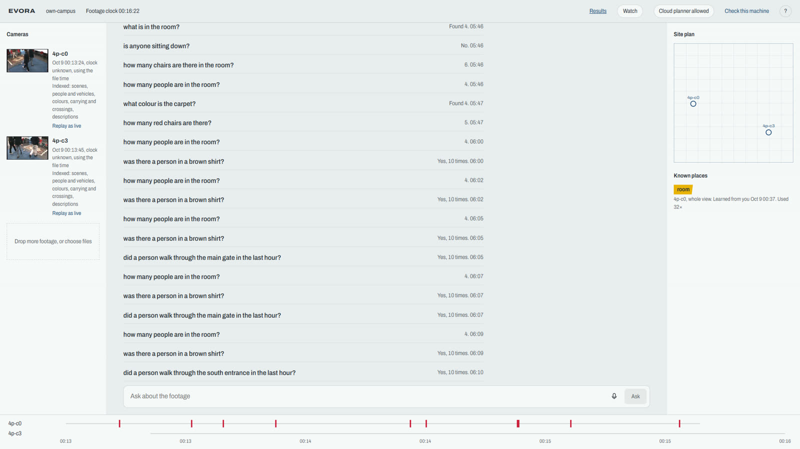

| | |
|---|---|
| 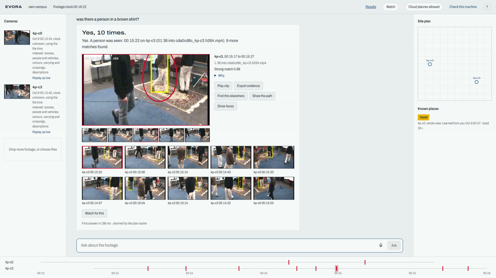 | 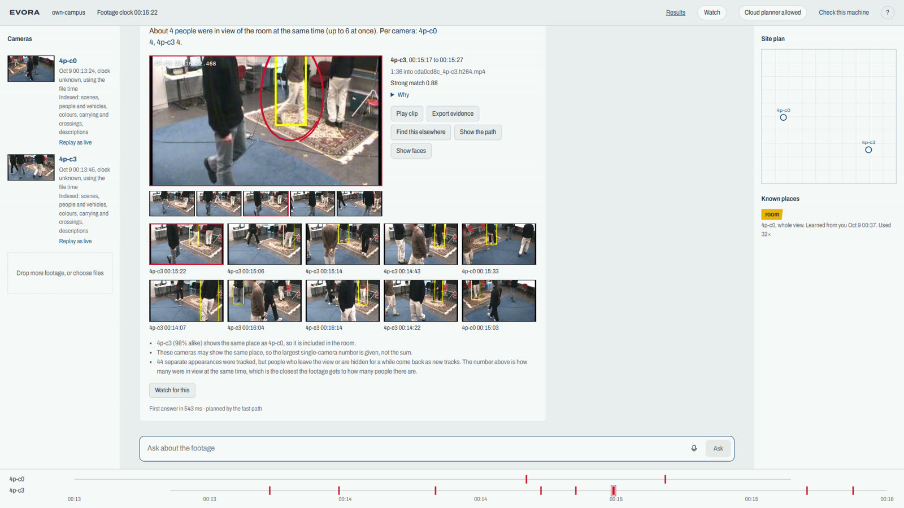 |
| **Answer with evidence.** Camera, time, the circled object, score and reasons, a clip, export and path buttons. | **Count answer.** "About 4 people in view at once", with the notes on separate appearances and estimated colours. |
| 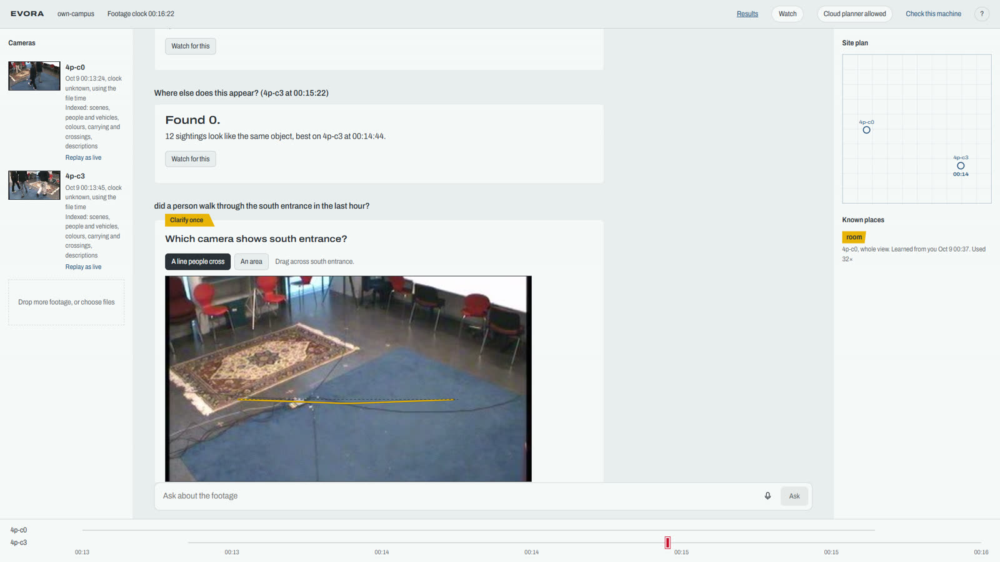 | 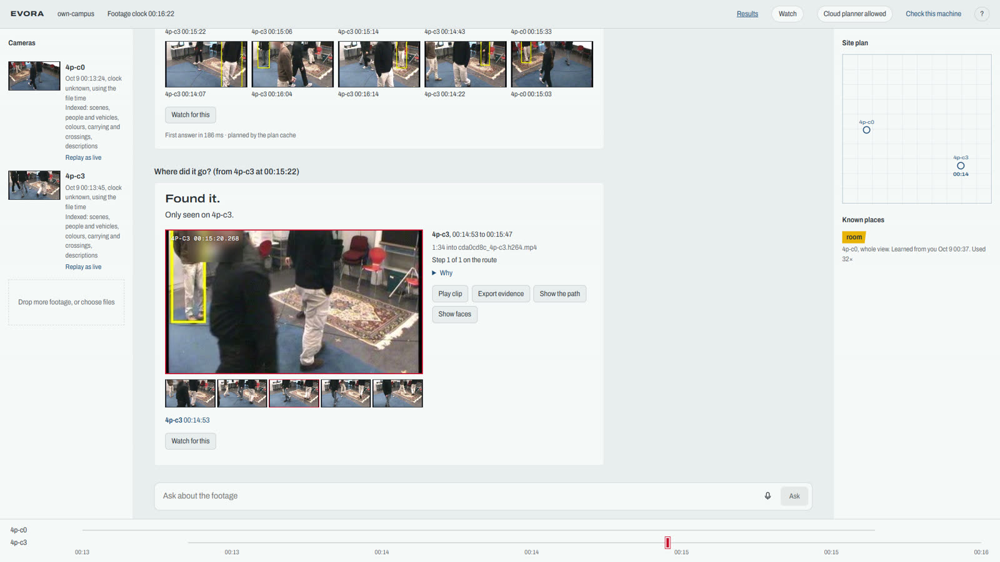 |
| **Ask once.** An unknown place asks one question; you pick the camera and draw the line. It is remembered. | **Identity across cameras.** The path of one person over the site plan, with the time between cameras. |
| 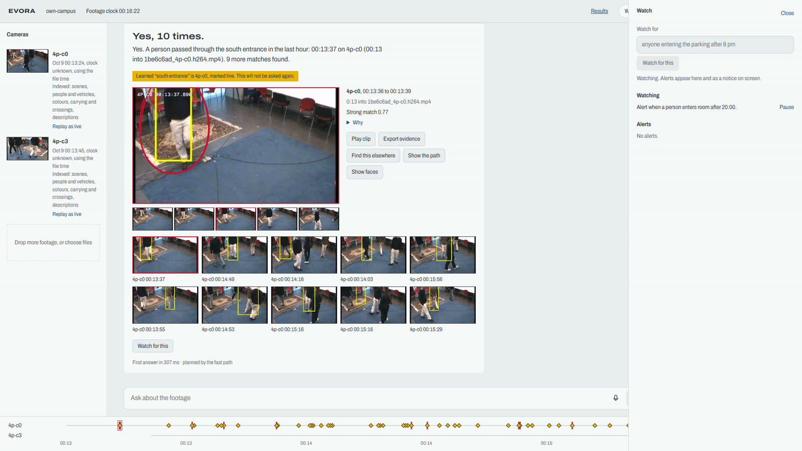 | 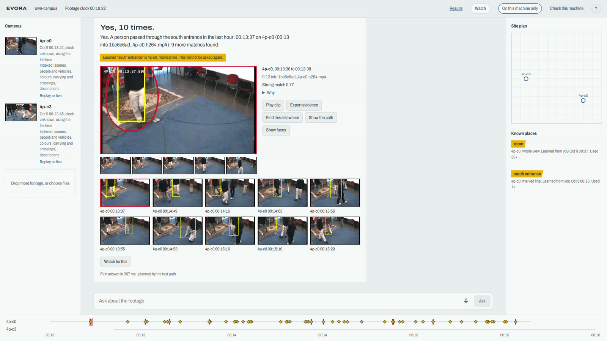 |
| **Standing questions.** "Notify me if anyone enters the room after 8 pm" becomes a rule that raises alerts. | **Privacy.** One switch keeps every model call on this machine; faces are blurred in everything shown. |
| 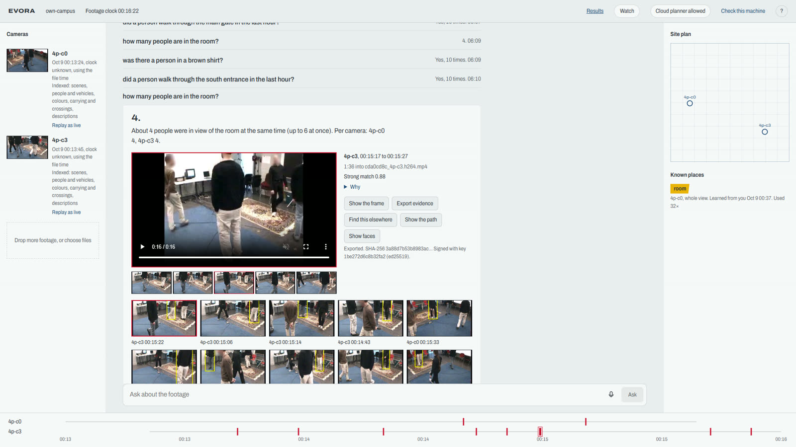 | 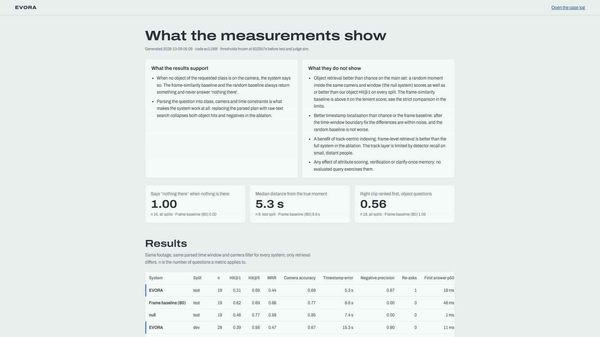 |
| **Evidence pack.** The clip, frames and a SHA-256 manifest with an Ed25519 signature, checkable offline. | **Results page.** The evaluation tables and ablations, read from `eval/reports/`. |

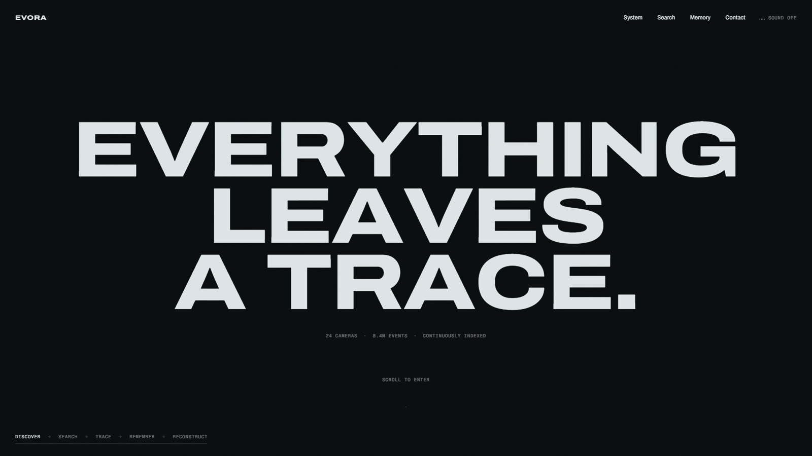

## Contents

1. [Scope: what is built, what is stretch, what is not done](#1-scope)
2. [Install, configure, run](#2-install-configure-run)
3. [Data pipeline](#3-data-pipeline)
4. [Core reasoning](#4-core-reasoning)
5. [Technologies, libraries and models](#5-technologies-libraries-and-models)
6. [Evidence and explanation in every answer](#6-evidence-and-explanation)
7. [Sample input and output](#7-sample-input-and-output)
8. [Reproducing the demonstrated results](#8-reproducing-the-results)
9. [Measured results and honest limits](#9-measured-results-and-limits)
   - [API at a glance](#api-at-a-glance), [Troubleshooting](#troubleshooting)
10. [Repository layout, tests, team, licence](#10-repository)

## 1. Scope

**Minimum viable solution (built and demonstrated)**

- Upload several camera files; each gets a start time from its file name, metadata, the on-screen clock (read by a local
  vision model) or by hand; indexing starts while you wait and the first camera is searchable within seconds.
- Ask a question in natural language, by text or voice; get a verdict (yes / no / found / count / partly answered), the
  evidence (camera, wall-clock time and time into the file, thumbnail, clip with the object circled, score, reasons).
- Ask-once memory: an unknown place triggers one question (pick the camera, optionally draw the gate line); it is stored
  in the workspace, survives a server restart, and later paraphrases resolve without asking.
- Honest negatives and partial answers; a second, independent visual check by a local vision model for look-based questions.
- Cross-camera identity ("where did this person go", "find this person elsewhere") with the walking time between cameras.

**Stretch goals (built, with the limits listed in section 9)**

- Standing questions and alerts ("notify me if anyone enters the parking zone after 8 pm"), phone push, replay of recorded
  files as live streams, real RTSP cameras.
- Retroactive zones (draw a line after indexing; crossings are recomputed from stored tracks in seconds).
- Actions read from trajectories: vehicles starting, stopping, turning, U-turns; people getting in or out of a vehicle;
  people standing together.
- Open-vocabulary objects (chairs, carpets, red objects), counts checked by the vision model, scene descriptions.
- Signed evidence packs (SHA-256 manifest, Ed25519 signature, offline verifier), face blur, on-prem mode that blocks
  non-loopback network traffic, a site plan with a floor-plan picture, an evaluation report page.

**Not done or not solid**

- No general activity recogniser: "pick something up", "put down", "open a door" are answered *"I can't tell"*.
- Counts of people are best read as "in view at once"; per-person counts over-count (the tracker splits one person in
  several tracks when they leave the view or are hidden).
- Live analysis was verified on replayed files and test doubles, not on a physical camera. No ONNX / OpenVINO export for
  CPU-only machines (the GPU path is the target).

## 2. Install, configure, run

**Needs:** Python 3.11 or 3.12 (uv fetches it), Node.js 20+, ffmpeg and ffprobe on PATH, [Ollama](https://ollama.com),
git. A GPU with 8 GB is strongly recommended (CPU works, much slower). Optional: Groq API keys (cloud planner),
MediaMTX (replay as live), an ntfy topic (phone alerts).

**Windows (what the demo laptop uses)**

```
git clone <this repo> && cd <repo>
copy .env.example .env                  :: then set evora_PROFILE=gpu (see below)
start.bat setup                         :: once: perception stack (CUDA PyTorch, detector, ReID, embeddings) and model weights
ollama pull qwen3-vl:4b-instruct        :: the one local vision/language model (3.3 GB)
python scripts/check_local_models.py    :: PYTHONPATH=backend; says whether this machine can look at footage
start.bat                               :: builds the UI if stale and serves everything on http://127.0.0.1:8700
```

**Linux / macOS**

```
make setup && make setup-perception     # environment (uv, Python 3.11+) and the model stack
make models                             # local model weights into ./models
ollama pull qwen3-vl:4b-instruct
make doctor                             # every problem comes with the command that fixes it (ARGS="--fix" runs them)
make up                                 # backend and built UI on http://127.0.0.1:8700   (ARGS="--live --open" optional)
```

**Configure (`.env`, never committed)**

| Key | Meaning |
|---|---|
| `evora_PROFILE` | `gpu`, `mps` or `cpu`. On `gpu` the detector sees 1080p frames at 1280 px and samples at least 4 frames per second; `cpu` keeps 640 px and 1 fps. |
| `evora_WORKSPACE` | the site folder (database, vectors, media, learned places) under `workspaces/` |
| `evora_ONPREM` | `1` = every model call stays on this machine and non-loopback connections are blocked |
| `OLLAMA_VISION_MODEL`, `OLLAMA_TEXT_MODEL` | set both to `qwen3-vl:4b-instruct` so exactly one model sits in GPU memory; `OLLAMA_MAX_LOADED_MODELS=1` |
| `GROQ_KEYS` | optional comma-separated keys for the cloud planner; without them a local model plans |
| `NTFY_TOPIC` | optional phone alerts |

**Use it:** open http://127.0.0.1:8700/app/ , drop camera files on the rail, ask in the bar at the bottom. The story page is
`/`, the evaluation report `/report`. The six-minute demo script is `docs/DEMO.md`; `docs/JUDGE_SIM.md` is the rehearsal on
unseen footage. A scripted browser rehearsal and its recording are described in `PROGRESS.md`.

## 3. Data pipeline

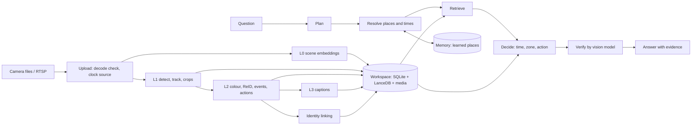

The same pipeline in text:

```
camera files / RTSP
   |  upload: decode check, rotation, variable frame rate by timestamp, clock source (file name -> metadata -> on-screen clock -> by hand)
   v
L0  scene embeddings        a frame and its four tiles every 2 s -> SigLIP2 -> LanceDB `scenes`         (searchable first)
L1  detect + track + crops  YOLO26 at up to 1280 px, ByteTrack, motion-gated sampling (4-8 fps), best 4 crops per track,
                            track points at 4 Hz -> SQLite `tracks`, `track_points`; crop embeddings -> LanceDB `crops`
L2  attributes + events     colour (person masks, survey-based naming, calibrated confidence), carrying, ReID vectors (OSNet AIN),
                            appear / disappear / zone / line events, action events from trajectories
    identity linking        stitching within a camera, strict cross-camera linking with learned walking times -> `global_ids`
L3  captions (deferred)     one factual line per track from the local vision model (up to 80 tracks per camera) -> BM25 + bge-small
   |
   v
workspace folder: SQLite + LanceDB + media (crops, scenes, clips), one per site, nothing shared between sites
```

Every layer reports its progress over a server-sent-event stream; queries work as soon as L0 finishes and improve as L1 to
L3 arrive. Zones drawn later only recompute events from stored track points (no video decode). Measured speed, on the demo
laptop: about 4 to 7 seconds of video per second per camera for L0 to L2 together (`eval/reports/throughput.md`).

## 4. Core reasoning

A question goes through five steps, all in `backend/evora/query/`:

1. **Plan.** A fast path parses common phrasings with no network call; otherwise a planner model (Groq, with the local
   model as fallback) returns a typed plan: targets with attributes (class, colour, carried item), place, action, time
   window, intent (exists / first / last / list / count / path / describe). The plan is sanitised by rules, so a small model's
   mistakes ("at what time" as a time range, "brown shirt" as a second object) cannot reach retrieval.
2. **Resolve.** Places and times are looked up in the workspace memory (aliases, embeddings, camera equivalence); an unknown
   one produces the single clarification.
3. **Retrieve.** Candidate tracks come from image-text similarity of crops (SigLIP2), stored attributes, caption text (BM25)
   and scene context; a candidate whose caption or stored colour shows another colour is a near miss at best.
4. **Decide.** Time windows, zones and actions are applied to stored events (line crossings, zone entries, vehicle and
   person-vehicle events). When attributes were asked for, only tracks with something behind them are counted or ranked first.
5. **Verify and compose.** For look-based questions a second local vision-model pass looks at the evidence frames and can set
   candidates aside; the answer text, verdict and confidence are composed from what was actually found, and a note says
   what could not be checked.

Identity across cameras (`backend/evora/reid/`) combines appearance (OSNet AIN), attributes and a learned walking-time
topology between camera pairs, solved per camera pair (Hungarian) with a strict appearance floor and a colour veto.
Counting uses separate within-camera groups, so a loose merge can lower a count but never corrupts a path.

## 5. Technologies, libraries and models

| Area | What |
|---|---|
| Backend | Python 3.11, FastAPI, server-sent events, pydantic v2, SQLite, LanceDB, PyAV, OpenCV, NumPy, SciPy |
| Frontend | Next.js (static export served by the API), TypeScript strict, types generated from `contracts/` |
| Detection and tracking | Ultralytics YOLO26 (detector, person masks), ByteTrack |
| Open-vocabulary objects | YOLOE-26 with the CLIP text encoder, run on stored frames at query time |
| Image and text embeddings | SigLIP2 base (`google/siglip2-base-patch16-224`), BAAI `bge-small-en-v1.5` through fastembed |
| Re-identification | OSNet AIN x1.0 trained on MSMT17, through BoxMOT |
| Colour | person masks + the xkcd colour survey (CC0) for naming, isotonic confidence calibration |
| Local language and vision | Qwen3-VL 4B instruct through Ollama (captions, verification, scene questions, counts) |
| Cloud planner (optional) | Groq-hosted open models, behind a gateway that on-prem mode closes |
| Faces and privacy | OpenCV YuNet detection and blur (no recognition); Ed25519-signed evidence packs |
| Live | MediaMTX (RTSP), PyAV grabber thread with a newest-frame mailbox |

Model weights are downloaded by `scripts/models_download.py` into `./models` and are not in git.

## 6. Evidence and explanation

Each answer carries, for every piece of evidence: the camera, the wall-clock time and the time into the source file, the
track and global identity, the box (normalised), a score, the list of reasons (`why`), a thumbnail and a clip with the object
marked, and whether the second look confirmed it. The answer carries the parsed plan, per-stage timings and notes. From an
answer you can open the clip, show the identity's path across cameras, find similar tracks, or export a signed evidence pack
(`python -m evora.evidence.pack verify <pack.zip>` checks every hash and the signature offline). Estimated colours, vision-model
counts and action cues are labelled as such.

## 7. Sample input and output

Input: two EPFL laboratory camera views of four people walking in a room (`4p-c0`, `4p-c3`, 157 s each, 360x288, no clock in
the files), uploaded through the UI; each indexed to L3 in about two minutes. The question, typed in the bar:

> at what time did the brown shirt guy enter the room

Plan (abridged): intent `first`, target person with attribute `brown`, place "the room" (a place taught earlier: camera 4p-c0,
whole view), action `enter`. Output (from `POST /api/query`, abridged):

```json
{
  "text": "The first match for person wearing a brown shirt entering the room was at 00:13:53 on 4p-c0 (00:29 into 1be6c6ad_4p-c0.h264.mp4).",
  "verdict": "found",
  "confidence": 0.7619,
  "notes": ["4p-c3 (98% alike) shows the same place as 4p-c0, so it is included in the room.",
            "14 of these colours were estimated from how the person looks, not read from the clothes, so they are less certain."],
  "evidence": [{
    "camera_name": "4p-c0", "t_peak": 1791485033.82, "offset_s": 29.2,
    "track_id": "cam_01:t000003", "global_id": "g000004",
    "bbox": [0.818, 0.102, 0.961, 0.686], "score": 0.7619,
    "why": ["siglip 0.12", "colour brown (estimated 0.45)", "caption match", "scene 0.75", "appear 1791485034"],
    "thumb_url": "/api/media/thumb/q_3fffb0e9d5_1.jpg", "clip_url": "/api/media/clip/q_3fffb0e9d5_1.mp4" }],
  "timings_ms": { "plan_total": 8.5, "retrieve": 765.7, "compose": 2.9, "ttfa": 826 }
}
```

More answers from the same run: *"how many people are in the room?"* -> "About 4 people were in view of the room at the same time
(up to 6 at once)"; *"was there a bus?"* -> "No bus was seen."; *"did a person get out of a vehicle?"* -> "I can't tell whether anyone was
getting out of a vehicle... I recognise people and vehicles, where they go and what they wear and carry, not actions like this";
*"how many red chairs are there?"* -> detector count at once (1), revised after the vision model's frame-by-frame count (about 5).

## 8. Reproducing the results

```
# data (public datasets, not in git; check each dataset's terms)
python scripts/data/fetch_epfl.py --only 6p terrace1 passageway1
python scripts/data/fetch_meva.py            # MEVA school window; annotations: see scripts/meva_to_queries.py
python scripts/data/fetch_wildtrack.py --zip # identity ground truth, about 6.8 GB

# index and ask
cd backend
PYTHONPATH=".;.." python -m evora.perception.cli ingest ../data/norm/epfl/6p-c0.mp4 ../data/norm/epfl/6p-c1.mp4 \
    --workspace demo --profile gpu --layers L0 L1 L2 --names 6p-c0 6p-c1       # use ":" instead of ";" on Linux/macOS
cd .. && evora_WORKSPACE=demo make up

# evaluation
make eval ARGS="--system ours --system b0 --split dev --workspace <indexed workspace>"
make ablate
python scripts/wildtrack_score.py wildtrack   # identity linking against WILDTRACK ground truth (see its docstring)
python scripts/check_local_models.py          # can this machine run the local models
make check                                    # ruff and the test suite (about 1,800 tests)
```

Numbers in this README were measured on the development laptop; the evaluation harness, queries and ground-truth
generation are in `eval/` and `scripts/meva_to_queries.py`. Re-running will give the same shape with small timing differences.

## 9. Measured results and limits

Retrieval, MEVA school site, eight cameras, one annotated five-minute window, questions generated from the annotations
(`eval/`). The latest index (1280 px detector, 4 fps floor, looser association, re-embedded identities):

| Split | n | Hit@1 | Strict Hit@1 | Hit@5 | Camera accuracy | Median time error | Negative precision |
|---|---|---|---|---|---|---|---|
| dev | 28 | 0.56 | 0.56 | 0.72 | 0.83 | 3.6 s | 1.00 |
| test | 19 | 0.31 | 0.31 | 0.69 | 0.85 | 17.4 s (activity questions dominate) | 0.67 |

The first index scored 0.33 Hit@1 on dev with a 14.8 s time error. These sets are small (one query moves test Hit@1 by 0.05)
and a frame-similarity baseline matches or beats us on plain object presence; what the system adds is honest negatives
(1.00 against 0.00), a localised time, and the structured answers. Read `docs/WRITEUP.md` for the full tables and ablations.

Perception, measured on ground truth (WILDTRACK, 7 cameras, people with ids; `scripts/wildtrack_score.py`):

- Re-identification: OSNet AIN separates people clearly better than the small model first used (same-camera AUC 0.87 against 0.80, cross-camera 0.78 against 0.63); cross-camera link precision 44% -> 74%.
- Tracking: looser association raised detection recall from 65% to 71% (EPFL 6p: 33 -> 22 tracks of at least 2 s for 6 people). Tiled detection was tried and rejected (recall +3 points, precision 0.48 -> 0.33).
- Merging fragments of one person within a camera is unsafe for identity (about 40% of loose merges join two different people), so it is used only for counts.
- Throughput and the detector, tracker, model comparisons are in `eval/reports/throughput.md`.

Limits, stated plainly: small distant people are still missed on busy cameras (G419: 26 tracks against 77 annotated people);
people counts per camera are not exact; colour is read for most but not all people and estimates are labelled; activities
other than the vehicle and standing-together cues are not recognised; the evaluation covers one site and window.

## API at a glance

The interface is a client of this API (`contracts/` holds the full specification and generated TypeScript types).

| Route | What it does |
|---|---|
| `POST /api/cameras` | upload camera files (multipart) or add an RTSP camera (JSON); returns each camera's clock and its source |
| `POST /api/ingest`, `GET /api/events` | start indexing; progress, answers, alerts and notes arrive on the event stream |
| `POST /api/query` | ask a question; a server-sent stream of `plan`, `evidence`, `answer`, `verified` or `clarify` events |
| `POST /api/clarify` | answer the one clarifying question (camera, optional line or area, or text) |
| `GET /api/globals/{id}/path`, `GET /api/tracks/{id}/similar` | the path of an identity across cameras; look-alike tracks |
| `POST /api/standing`, `GET /api/alerts` | standing questions and their alerts |
| `POST /api/live/replay` | replay recorded files as live streams, optionally analysed as they play |
| `POST /api/evidence/{id}/pack` | export a signed evidence pack |
| `GET /api/health`, `POST /api/settings` | machine state, privacy switch |
| `GET /api/report` | the evaluation report shown on `/report` |

## Troubleshooting

| Symptom | Fix |
|---|---|
| Cameras stop with "No module named 'torch'" | the perception stack is not installed: `start.bat setup` (or `make setup-perception`), then restart; a failed camera is retried on start |
| "ffmpeg not found" | install ffmpeg and open a new terminal so PATH is refreshed |
| Small or distant people are missed | set `evora_PROFILE=gpu` in `.env` (the `cpu` profile uses a 640 px detector and 1 fps) |
| The first question of the day takes 10 seconds | the local model is loading; ask one throwaway question before a demo |
| Answers say "I can't look for X here" or describe nothing | `ollama pull qwen3-vl:4b-instruct`, set `OLLAMA_VISION_MODEL`, run `python scripts/check_local_models.py` |
| Anything else | `make doctor` lists every problem with the command that fixes it |

## 10. Repository

- `contracts/` frozen v1 contracts: pydantic models, SQLite schema, vector tables, API spec, fixtures, generated TypeScript types.
- `backend/evora/` the package: `perception/` (decode, clock, detect, track, attributes, events, actions, captions, live), `reid/`
  (features, linking, paths), `query/` (planner, retrieval, logic, verification, composition), `memory/`, `alerts/`, `evidence/`,
  `llm/` (gateway), `api/`, `core/` (jobs, workspace, privacy guard, doctor).
- `frontend/` the interface (story at `/`, product at `/app`, report at `/report`). `eval/` harness, queries, reports. `config/`
  tunables and profiles. `scripts/` data fetchers, model downloads, doctor, scoring and calibration tools. `docs/` write-up,
  demo script, judge rehearsal, architecture. `PROGRESS.md` the team log.
- Tests: `make check` (lint, backend tests, generated types in sync); `make offline-test` runs the suite with the network blocked.

Team: M1 platform and memory, M2 perception and identity, M3 reasoning and retrieval, M4 interface.

**Licence.** AGPL-3.0 (`LICENSE`), because Ultralytics and BoxMOT are AGPL-3.0. SigLIP2 and Qwen models are Apache-2.0,
bge-small is MIT; the datasets keep their own terms.
